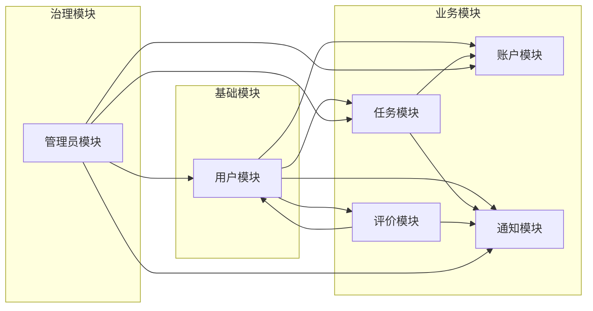
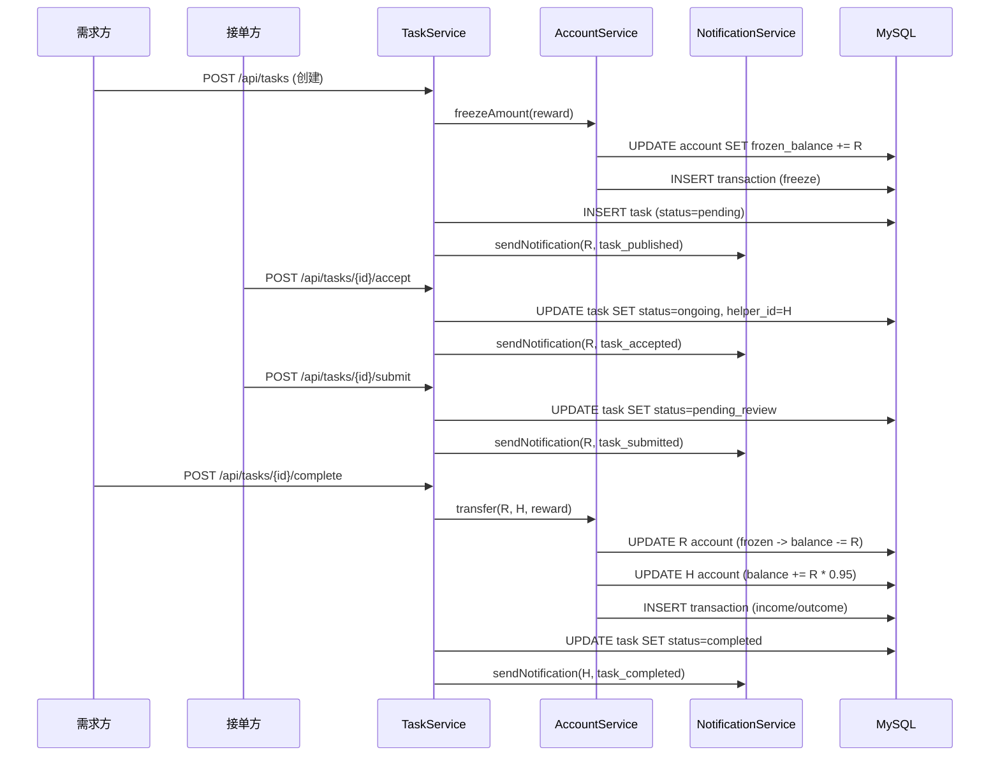
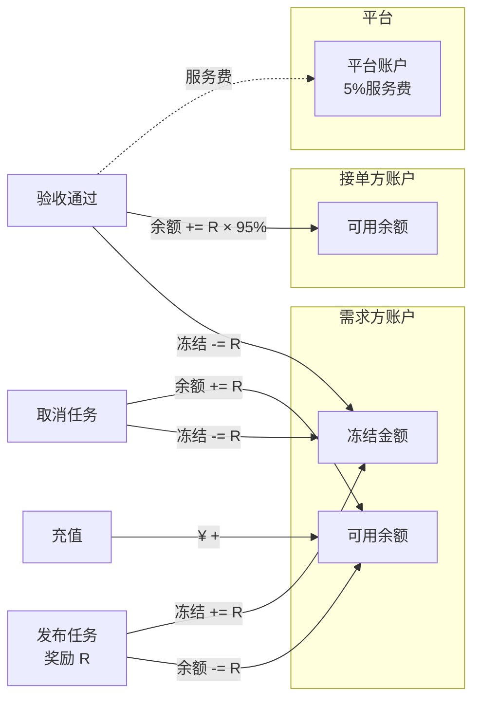
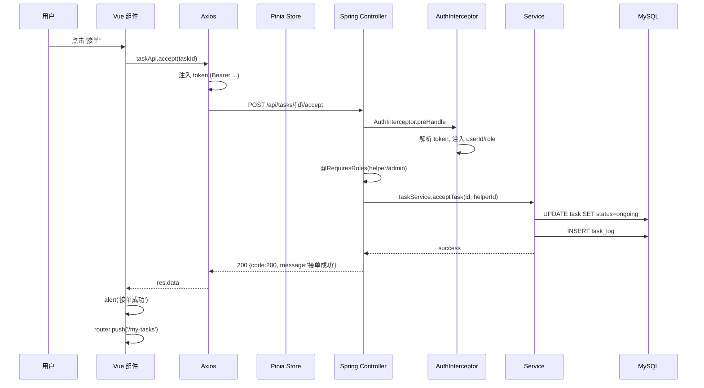
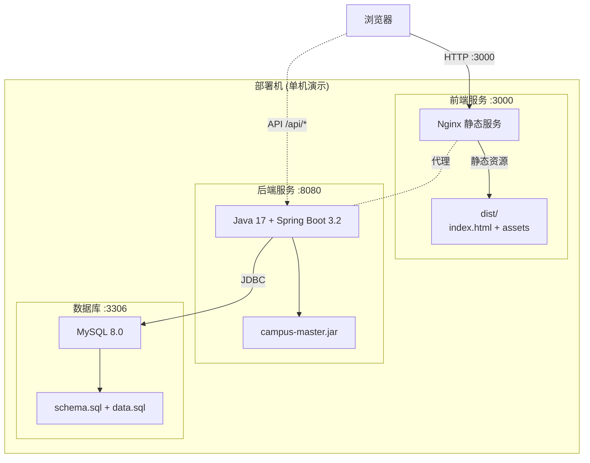
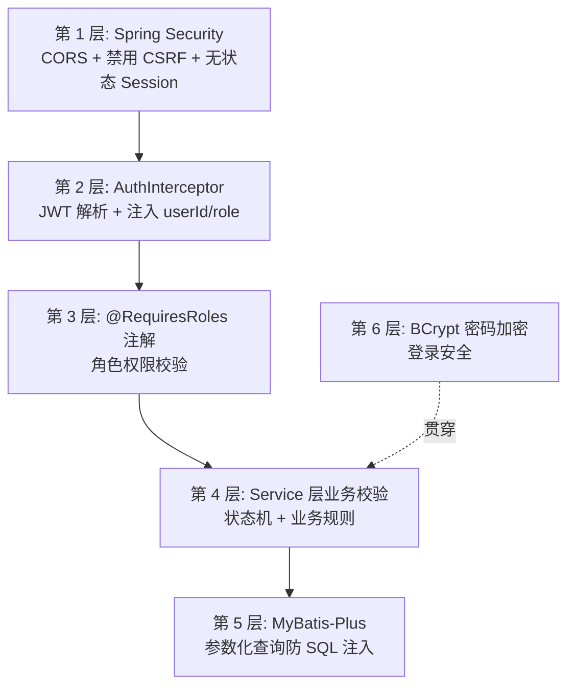

# Step 4 · 系统架构图（Mermaid）

> **Step 目标**：用 Mermaid 画出本项目的分层架构、模块依赖、数据流、部署架构。  
> **风格**：所有图都用 Mermaid 文本描述（答辩时可渲染、可复制、可维护）。

---

## 一、整体分层架构图

```mermaid
graph TB
    subgraph 用户层["用户层"]
        U1[PC 浏览器]
        U2[移动浏览器]
    end

    subgraph 前端层["前端层 (Vue 3 SPA)"]
        F1[页面组件 Views]
        F2[公共组件 Components]
        F3[路由 Router]
        F4[状态管理 Pinia]
        F5[API 封装 Axios]
    end

    subgraph 网关层["网关层"]
        G1[Axios 拦截器<br/>Token 注入]
        G2[Vite 代理<br/>/api -> :8080]
    end

    subgraph 后端层["后端层 (Spring Boot 3.2)"]
        B1[Controller<br/>REST API]
        B2[Service<br/>业务逻辑]
        B3[Mapper<br/>MyBatis-Plus]
        B4[Common<br/>Result/Jwt/Exception]
        B5[Interceptor<br/>Auth/Role]
        B6[WebSocket<br/>/ws/{userId}]
    end

    subgraph 数据层["数据层"]
        D1[(MySQL 8.0)]
        D2[HikariCP 连接池]
    end

    U1 & U2 --> F1
    F1 --> F2 & F3 & F4
    F4 --> F5
    F5 --> G1
    G1 --> G2
    G2 --> B1
    B1 --> B5
    B5 --> B2
    B2 --> B3
    B3 --> D2
    D2 --> D1
    B1 -.WebSocket.-> B6
    B6 -.推送.-> F1
```

---

## 二、模块依赖图



---

## 三、任务状态流转图（数据流维度）



---

## 四、资金流转图（重点！）



---

## 五、前后端请求时序图



---

## 六、部署架构图



---

## 七、安全防护层次图



---

## 八、目录结构图

```
项目根目录
├── backend/                          # Spring Boot 后端
│   ├── pom.xml                       # Maven 依赖
│   └── src/main/
│       ├── java/com/example/campusmaster/
│       │   ├── CampusMasterApplication.java
│       │   ├── annotation/RequiresRoles.java
│       │   ├── common/               # Result / BusinessException / JwtUtil / GlobalExceptionHandler
│       │   ├── config/               # Security / MyBatisPlus / WebMvc / WebSocket / OpenApi
│       │   ├── controller/           # User / Task / Account / Notification / Review / Admin
│       │   ├── entity/               # 8 个实体
│       │   ├── interceptor/          # Auth / Role
│       │   ├── mapper/               # 8 个 Mapper
│       │   ├── service/ + impl/      # 业务实现
│       │   └── websocket/WebSocketServer.java
│       └── resources/
│           ├── application.yml
│           ├── application-local.example.yml
│           ├── schema.sql + data.sql
│           └── mybatis-config.xml
│
├── src/                              # Vue 3 前端
│   ├── api/index.js                  # API 封装
│   ├── components/                   # 14 个公共组件
│   ├── views/                        # 11 个页面
│   ├── stores/user.js                # Pinia
│   ├── router/index.js               # 路由 + 守卫
│   ├── mock/index.js                 # 旧 Mock（已门控）
│   ├── utils/request.js              # Axios 封装
│   ├── utils/websocket.js            # WS 客户端
│   ├── App.vue + main.js
│   └── style.css
│
├── 文档/                             # 13 份 v1.0 文档 + 10 个 stepX 文件夹
│   ├── 00-总实施计划与AI协作方法论.md
│   ├── step1-产品定义与PRD/
│   ├── step2-UI-UX高保真原型/
│   ├── step3-API接口契约设计/
│   ├── step4-技术选型与系统架构/
│   ├── ...
│   └── AI协作记录沉淀/              # 人机协作亮点归档
│
├── API接口文档.md                    # v1.0 接口文档
├── Web开发技术基础课程设计-3.pdf      # 课程 PPT
├── 课程设计验收及提交材料说明.pdf     # 验收材料
├── package.json + vite.config.js + tailwind.config.js
└── README.md
```

---

## 九、评审时按"画哪张图"匹配"问题"

| 评委问什么 | 展示哪张图 |
|----------|----------|
| "你们系统怎么分层？" | 一、整体分层架构图 |
| "模块之间怎么调用？" | 二、模块依赖图 |
| "任务完整流程？" | 三、状态流转时序图 |
| "钱怎么流转？" | 四、资金流转图（重点） |
| "前端怎么请求后端？" | 五、请求时序图 |
| "怎么部署？" | 六、部署架构图 |
| "安全怎么做的？" | 七、安全防护层次图 |
| "目录长什么样？" | 八、目录结构图 |
