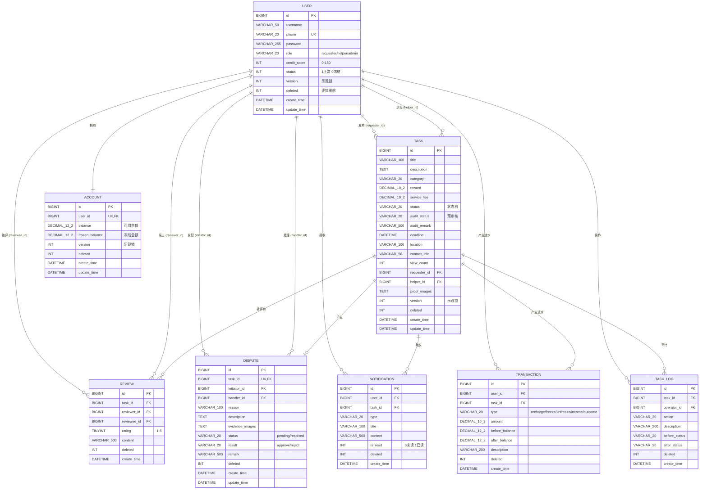
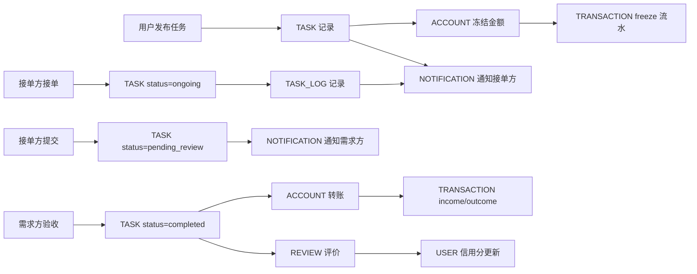

# Step 5 · ER 关系图（Mermaid erDiagram）

> **Step 目标**：基于 schema.sql 画出实体关系图，视觉化展示 8 张表之间的逻辑联系。  
> **语法**：Mermaid erDiagram（标准 ER 图语法）

---

## 一、ER 关系总览

---

## 二、关系数量与基数说明

| 关系 | 实体 A | 实体 B | 基数 | 业务含义 |
|------|--------|--------|------|---------|
| 发布任务 | USER | TASK | 1 : 0..* | 一个用户可发布多个任务 |
| 承接任务 | USER | TASK | 1 : 0..1 | 一个任务最多被 1 个用户承接（helper_id 可空） |
| 拥有账户 | USER | ACCOUNT | 1 : 1 | 一个用户恰好 1 个账户 |
| 产生流水 | USER | TRANSACTION | 1 : 0..* | 一个用户可有多条流水 |
| 接收通知 | USER | NOTIFICATION | 1 : 0..* | 一个用户可收多条通知 |
| 被评价 | USER | REVIEW | 1 : 0..* | 一个用户可被评多次 |
| 发出评价 | USER | REVIEW | 1 : 0..* | 一个用户可发多条评价 |
| 发起争议 | USER | DISPUTE | 1 : 0..* | 一个用户可发起多个争议 |
| 处理争议 | USER | DISPUTE | 1 : 0..* | 一个管理员可处理多个争议（handler_id 可空） |
| 操作日志 | USER | TASK_LOG | 1 : 0..* | 一个用户可产生多条任务日志 |
| 任务被评价 | TASK | REVIEW | 1 : 0..2 | 一个任务最多 2 条评价（双方各 1 条） |
| 任务产生争议 | TASK | DISPUTE | 1 : 0..1 | 一个任务最多 1 个争议（task_id UNIQUE） |
| 任务触发通知 | TASK | NOTIFICATION | 1 : 0..* | 一个任务可触发多条通知 |
| 任务产生流水 | TASK | TRANSACTION | 1 : 0..* | 一个任务可产生多条流水 |
| 任务审计 | TASK | TASK_LOG | 1 : 0..* | 一个任务有多条状态变更日志 |

---

## 三、关键约束的 ER 体现

### 3.1 唯一约束

| 实体 | 字段 | 约束 | 业务含义 |
|------|------|------|---------|
| USER | phone | UNIQUE | 手机号唯一 |
| ACCOUNT | user_id | UNIQUE | 一个用户一个账户 |
| REVIEW | (task_id, reviewer_id) | UNIQUE | 一个 reviewer 对一个 task 只能评 1 次 |
| DISPUTE | task_id | UNIQUE | 一个任务最多 1 个争议 |

### 3.2 非空约束（业务必填）

| 实体 | 字段 | 业务含义 |
|------|------|---------|
| USER | username / phone / password / role | 注册必填 |
| TASK | title / category / reward / status / requester_id | 发布必填 |
| ACCOUNT | user_id | 与用户同时创建 |
| TRANSACTION | user_id / type / amount / before_balance / after_balance | 流水必填 |
| REVIEW | task_id / reviewer_id / reviewee_id / rating | 评价必填 |
| NOTIFICATION | user_id / type / title | 通知必填 |
| DISPUTE | task_id / initiator_id / reason | 争议必填 |
| TASK_LOG | task_id / operator_id / action | 日志必填 |

---

## 四、ER 图对应的"业务闭环"

---

## 五、与 v1.0 文档中"ER 关系图"对比

| v1.0 文档的 ER 图 | v2.0（本 Step）的 ER 图 |
|------------------|---------------------|
| 简化的 ASCII 图 | **标准 Mermaid erDiagram 语法** |
| 标注部分字段 | **完整字段 + 类型 + 约束** |
| 关系说明散落文字 | **关系数量与基数表**（15 个关系） |
| 无 | **业务闭环流程图**（新增） |

> 💡 **亮点评审**：v2.0 ER 图**可直接渲染为 SVG**（GitHub/Notion/Typora 都支持），**答辩时直接展示**。

---

## 六、ER 图的"防御性"解读

> 📌 **如果评委质疑 ER 图的合理性，可以从以下角度回答**：

| 可能的质疑 | 防御性回答 |
|----------|---------|
| "为什么不用外键约束？" | schema.sql 出于**性能考虑未加外键**（外键会影响 INSERT/UPDATE 性能）——业务层用 Service 校验替代。**详见 §02-数据建模审计报告** |
| "为什么 REVIEW 唯一约束是 (task_id, reviewer_id)？" | 一个用户对一个任务只能评 1 次，避免重复评价 |
| "为什么 DISPUTE task_id UNIQUE？" | 一个任务最多 1 个争议（避免重复发起） |
| "为什么 TRANSACTION 用 before/after_balance 双重记录？" | **可追溯性**——除了金额，还知道变动前/后余额 |
| "为什么 NOTIFICATION 不加 task_id UNIQUE？" | 一个任务可触发多条通知（如被接单 + 被评价 + 状态变更） |

---

## 七、ER 图的"已知不完美"（坦诚记录）

| 问题 | 现状 | 影响 | 改进方向 |
|------|------|------|---------|
| 无外键约束 | schema.sql 全部不建 FK | 数据一致性靠 Service 校验保证 | v2 可加 FK（MySQL 8.0 支持） |
| TASK 表 audit_status 与 status 重复 | 两个状态字段并存 | 概念略冗余 | 评审时解释："audit 是预审核，status 是运行时" |
| 缺 review 的"匿名评价"支持 | 未实现匿名 | 业务缺口 | PRD §7 已标"本期不做" |
| 缺消息/聊天表 | IM 未实现 | 业务缺口 | PRD §7 已标"选做未实现" |
