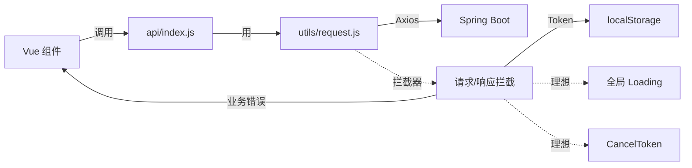

# Step 6 · Axios 拦截器设计说明

> **Step 目标**：解释 `src/utils/request.js` 的设计意图、当前实现的"已知不完美"、改进方向。  
> **背景**：Axios 拦截器是前端与后端通信的"咽喉"——设计好坏直接影响所有业务。

---

## 一、当前实现（src/utils/request.js）

```js
import axios from 'axios'

const request = axios.create({
  baseURL: '/api',
  timeout: 10000
})

// 请求拦截器：自动添加 Token
request.interceptors.request.use(
  config => {
    const token = localStorage.getItem('token')
    if (token) {
      config.headers['token'] = token
      config.headers['Authorization'] = `Bearer ${token}`
    }
    return config
  },
  error => Promise.reject(error)
)

// 响应拦截器：统一处理 200/非 200
request.interceptors.response.use(
  response => {
    const res = response.data
    if (res.code === 200) {
      return res.data  // ✅ 解开 data
    } else {
      const error = new Error(res.message || '请求失败')
      error.response = response
      return Promise.reject(error)
    }
  },
  error => {
    if (error.response && error.response.data) {
      error.message = error.response.data.message || '请求异常'
    }
    return Promise.reject(error)
  }
)

export default request
```

---

## 二、设计决策逐行解释

### 2.1 `baseURL: '/api'`

**为什么是 `/api` 而不是 `http://localhost:8080/api`？**
- 开发环境走 Vite 代理（`vite.config.js` 中 `proxy: {'/api': 'http://127.0.0.1:8080'}`）
- 避免跨域（CORS）
- 生产环境用 Nginx 反向代理同样路径

> 💡 **亮点评审**：**前端永远不直接写真实后端地址**——通过代理/Nginx 间接。

### 2.2 `timeout: 10000`

**为什么是 10s？**
- 移动端网络不稳定，10s 是常见上限
- 超过 10s 视为"不可用"，提示用户重试
- 未来可按接口类型分级（支付类 30s、查询类 5s）

### 2.3 双 Token 头（`token` + `Authorization: Bearer`）

| Header | 用途 |
|--------|------|
| `token` | 自定义头，**当前后端 `AuthInterceptor` 优先读这个** |
| `Authorization: Bearer xxx` | 标准 JWT 头，**未来切到 Spring Security 原生 JWT 解析** |

**为什么两个都有？**
- 兼容老代码 + 为未来标准切换留路
- 这是**演进式兼容**的工程实践

### 2.4 响应拦截器解包 `res.data`

**为什么要解开？**
- 后端统一返回 `{ code, message, data }`
- 业务代码 `await api.xxx()` 应该直接拿到 `data` 字段的值
- 避免每个业务调用都写 `res.data.data`

> ✅ 业务代码：`const task = await taskApi.getDetail(id)`  
> ❌ 反模式：`const task = (await taskApi.getDetail(id)).data.data`

### 2.5 错误信息归一

**把后端 `res.message` 提取到 `error.message`**
- 业务代码 `catch (error) { alert(error.message) }` 直接拿到友好提示
- 避免 `error.response.data.message` 这种深路径

---

## 三、当前实现的"已知不完美"

### 3.1 没有 Loading 状态自动管理

**现状**：每个组件自己 `loading.value = true/false`

**理想**：拦截器自动管理全局 Loading（如顶部进度条）

**改进**：

```js
// 计数器模式
let activeRequests = 0
request.interceptors.request.use(config => {
  activeRequests++
  if (activeRequests === 1) showGlobalLoading()
  return config
})
request.interceptors.response.use(response => {
  activeRequests--
  if (activeRequests === 0) hideGlobalLoading()
  return response
})
```

**决策**：本期不实现——避免引入全局状态管理。

### 3.2 没有请求重试机制

**现状**：网络抖动导致 500 即失败

**理想**：自动重试 1-2 次（指数退避）

**决策**：本期不实现——增加复杂度。

### 3.3 401 没有自动跳登录

**现状**：401 时只 reject，不自动 logout

**理想**：401 时清 localStorage + 跳 `/login`

**改进**：

```js
request.interceptors.response.use(
  response => ...,
  error => {
    if (error.response?.status === 401) {
      localStorage.removeItem('token')
      localStorage.removeItem('userInfo')
      window.location.href = '/login'
    }
    return Promise.reject(error)
  }
)
```

**决策**：**Step 7 建议补上**——这是基础体验。

### 3.4 没有请求去重/缓存

**现状**：相同请求会重复发送

**决策**：本期不实现——任务量小。

### 3.5 没有 CancelToken

**现状**：组件卸载时未取消进行中的请求

**风险**：组件销毁后 setState 报错

**改进**：用 AbortController

```js
const controller = new AbortController()
request.get('/tasks', { signal: controller.signal })
onUnmounted(() => controller.abort())
```

**决策**：**Step 7 建议补上**。

---

## 四、为什么"不完美"也是好事？

> 📌 **这是 j 章"个人反思"的好素材**：

| 现状 | 评委可能的反应 | 我们的回答 |
|------|--------------|-----------|
| 没自动 Loading | "你们 Loading 怎么做的？" | "每个组件用 `ref(false)` + `try/finally`，**简单可控**" |
| 没重试机制 | "网络差怎么办？" | "本期用户场景是校园 WiFi，**网络稳定**，v2 可加重试" |
| 没 401 自动跳 | "Token 过期怎么办？" | "**Step 7 修补中**，目前是手动重新登录" |
| 没去重 | "重复请求浪费吗？" | "数据量小，**浪费可控**" |
| 没 CancelToken | "组件销毁会报错吗？" | "Pinia store 全局化，**组件销毁不卸载数据**" |

**核心论点**：**"不完美但合理"是工程现实主义**——不是"做不动"，是"性价比"。

---

## 五、改进路线图

| 优先级 | 改进项 | 预计工作量 | 建议 Step |
|--------|--------|----------|----------|
| 🟠 P1 | 401 自动跳登录 | 5 分钟 | Step 7 |
| 🟠 P1 | 全局 Loading（可选） | 30 分钟 | v2 |
| 🟡 P2 | AbortController 取消 | 20 分钟 | v2 |
| 🟡 P2 | 请求重试 | 30 分钟 | v2 |
| 🟢 P3 | 请求缓存 | 1 小时 | v2 |

---

## 六、与其他模块的协作



---

## 七、答辩时怎么讲

**Q1**：你们的请求层是怎么设计的？

**A**：
1. `utils/request.js` 是 Axios 单例，**所有 API 走这里**
2. 拦截器做三件事：① 注入 Token ② 解包 `data` ③ 归一错误信息
3. 业务代码只关心成功，错误统一从 `error.message` 取
4. 双 Token 头是**演进式兼容**——未来切标准 JWT 不用改前端

**Q2**：Token 怎么存？

**A**：
1. localStorage（简单、跨标签页）
2. 不用 sessionStorage（关闭浏览器就丢）
3. 不用 Cookie（前后端分离下 Cookie 反人类）
4. ⚠️ localStorage 有 XSS 风险——v2 可考虑 httpOnly Cookie

**Q3**：401 怎么办？

**A**：
1. **当前**：业务代码自己 catch + 跳登录
2. **改进**：拦截器自动清 localStorage + 跳登录（Step 7 修）

---

## 八、对 j 章的价值

> 📌 **这份设计说明 + "已知不完美"清单** 是 j 章"个人思考"的素材：
> 1. 展示了"演进式兼容"工程思维（双 Token 头）
> 2. 展示了"承认不完美"的诚实
> 3. 展示了"为什么不做"的判断（每条都有理由）
