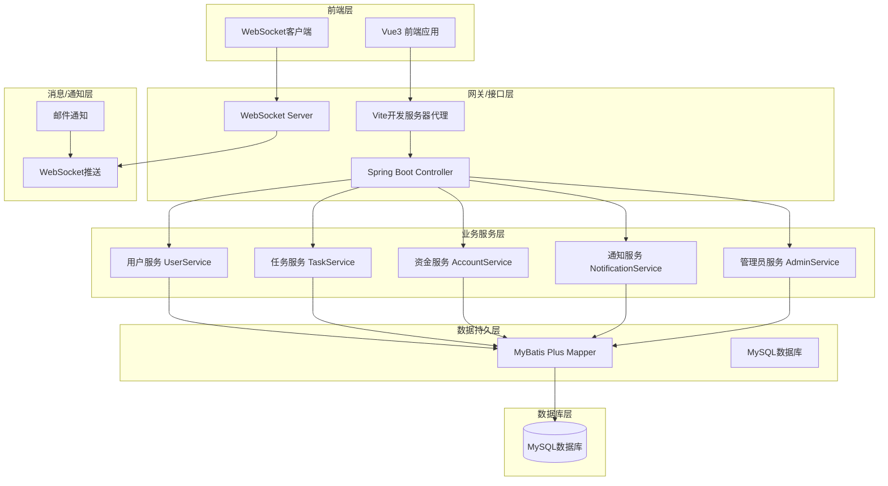
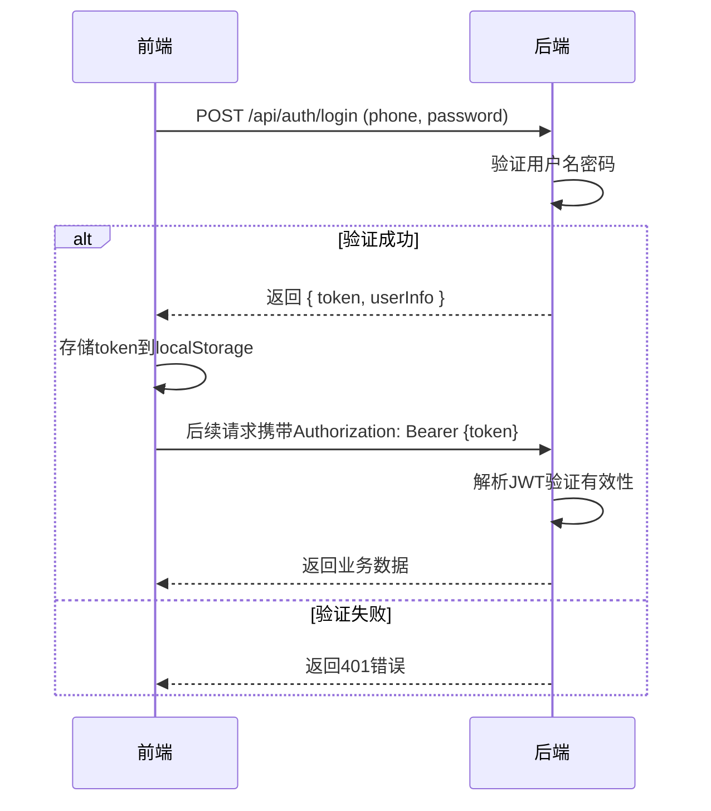
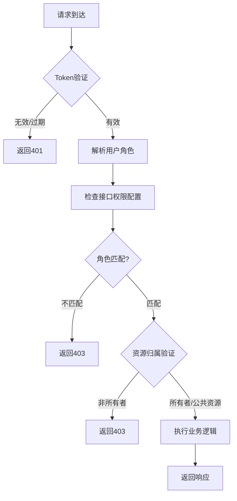
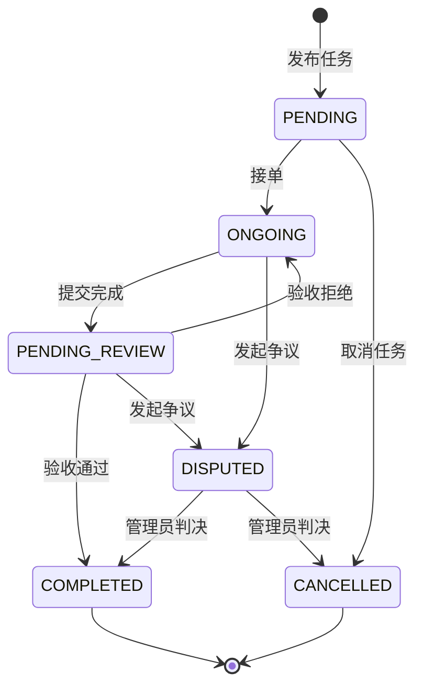
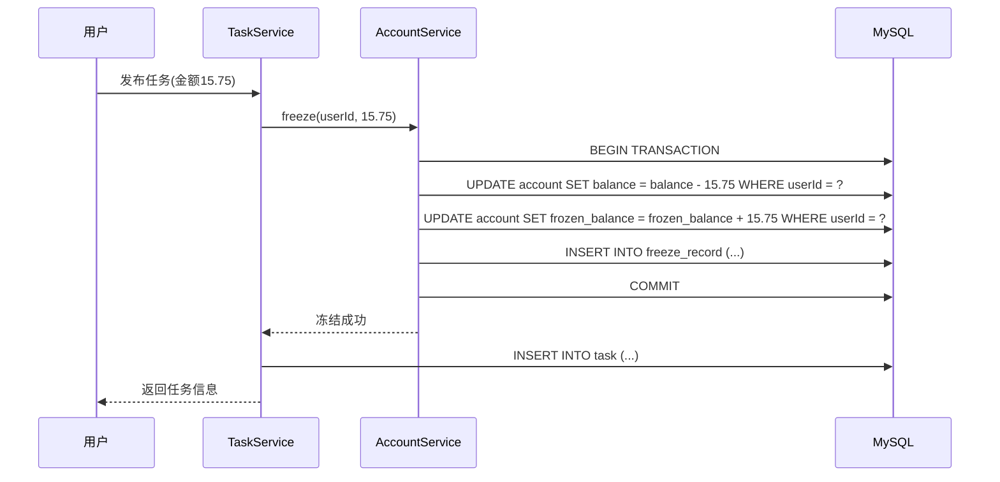
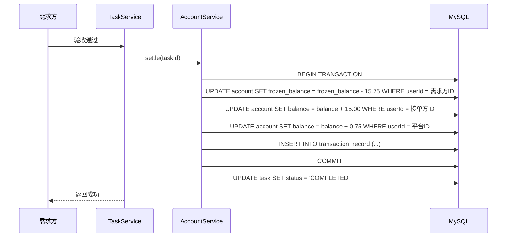
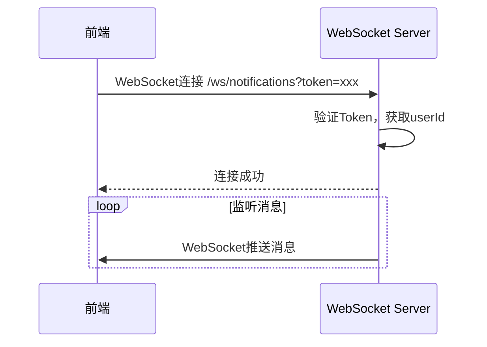
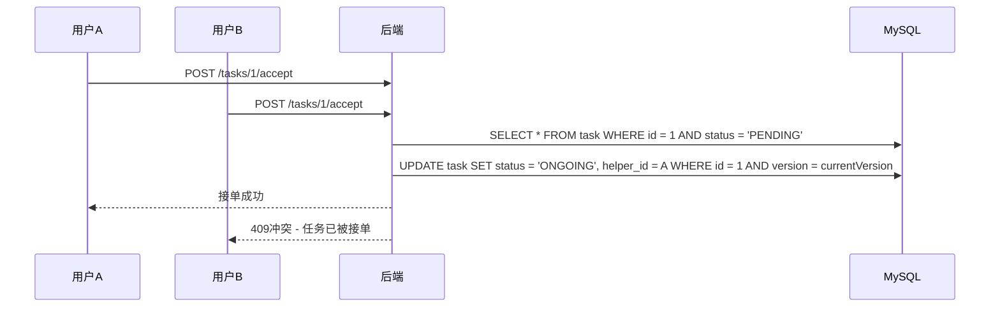
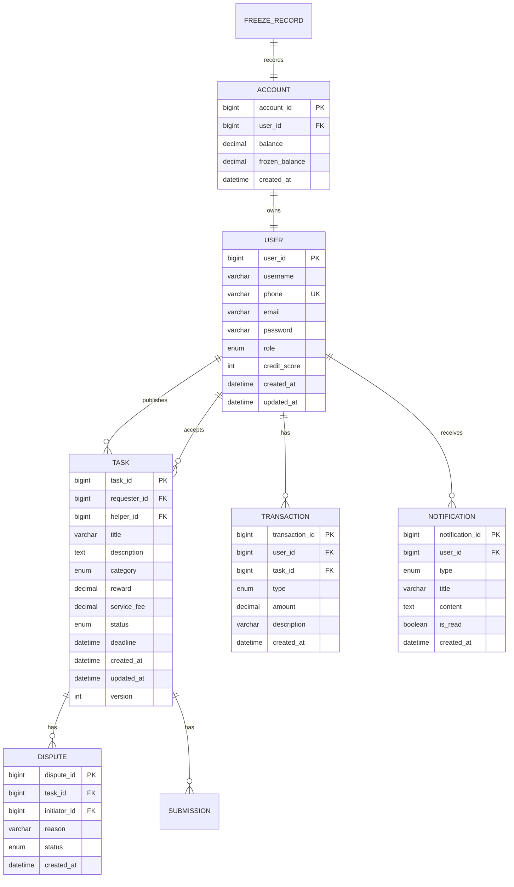

# 校园万事达互助众包任务平台 - 技术选型与系统架构设计

---

## 1. 技术栈选型

### 1.1 前端技术栈

| 分类 | 技术 | 版本 | 选型理由 |
|------|------|------|----------|
| 框架 | Vue.js | 3.4.x | 渐进式框架，学习曲线平缓，生态成熟，适合学生快速上手 |
| 构建工具 | Vite | 5.2.x | 极速开发体验，热更新快，配置简单 |
| UI样式 | Tailwind CSS | 3.4.x | 原子化CSS，快速构建界面，无需写大量CSS |
| 路由 | Vue Router | 4.3.x | Vue官方路由库，与Vue3完美集成 |
| 状态管理 | Pinia | 2.1.x | Vue官方状态管理，轻量易用 |
| HTTP客户端 | Axios | 1.6.x | 成熟稳定，支持拦截器、取消请求等功能 |

### 1.2 后端技术栈

| 分类 | 技术 | 版本 | 选型理由 |
|------|------|------|----------|
| 框架 | Spring Boot | 3.2.x | 社区成熟，生态完善，便于快速构建RESTful服务 |
| 语言 | Java | 17 | LTS版本，性能稳定，学习资源丰富 |
| 数据库 | MySQL | 8.0.x | 开源关系型数据库，社区活跃，适合中小型项目 |
| ORM框架 | MyBatis Plus | 3.5.x | 简化CRUD操作，支持Lambda表达式，学习成本低 |
| 实时通信 | WebSocket | 内置 | Spring Boot内置WebSocket实现实时通知 |
| 权限认证 | JWT | JJWT | 无状态认证，易于扩展，适合前后端分离架构 |

### 1.3 部署环境

| 环境 | 建议配置 |
|------|----------|
| 开发环境 | 本地Windows/Linux + IDEA/VSC |

---

## 2. 系统整体架构

### 2.1 架构层次图



### 2.2 架构层次说明

| 层级 | 说明 | 核心职责 |
|------|------|----------|
| **前端层** | 用户交互界面 | 页面渲染、用户操作、状态管理 |
| **网关/接口层** | 统一入口 | 请求转发、负载均衡、安全控制 |
| **业务服务层** | 核心业务逻辑 | 用户管理、任务管理、资金管理、通知管理 |
| **数据持久层** | 数据访问 | ORM操作、缓存管理、事务控制 |
| **数据库层** | 数据存储 | 结构化数据存储、索引优化 |
| **消息/通知层** | 异步通信 | 实时通知、事件广播、邮件发送 |

---

## 3. 标准项目目录结构

### 3.1 前端目录结构

```
frontend/                              # Vue前端项目根目录
├── public/                            # 静态资源
│   └── index.html                     # HTML入口文件
├── src/
│   ├── components/                    # 公共组件
│   │   ├── AppLayout.vue              # 布局组件
│   │   ├── BaseButton.vue             # 基础按钮
│   │   ├── Navbar.vue                 # 导航栏
│   │   ├── StatusTag.vue              # 状态标签
│   │   └── TaskCard.vue               # 任务卡片
│   ├── views/                         # 页面组件
│   │   ├── Home.vue                   # 任务大厅
│   │   ├── Login.vue                  # 登录页
│   │   ├── Register.vue               # 注册页
│   │   ├── Publish.vue                # 发布任务
│   │   ├── MyTasks.vue                # 我的任务
│   │   ├── TaskDetail.vue             # 任务详情
│   │   ├── SubmitTask.vue             # 提交完成
│   │   ├── ReviewTask.vue             # 验收任务
│   │   ├── RateTask.vue               # 评价任务
│   │   ├── Profile.vue                # 个人中心
│   │   └── Admin.vue                  # 管理后台
│   ├── router/                        # 路由配置
│   │   └── index.js                   # 路由定义
│   ├── stores/                        # 状态管理(Pinia)
│   │   └── user.js                    # 用户状态
│   ├── utils/                         # 工具函数
│   │   ├── request.js                 # Axios封装
│   │   ├── auth.js                    # 认证工具
│   │   └── format.js                  # 格式化工具
│   ├── App.vue                        # 根组件
│   ├── main.js                        # 入口文件
│   └── style.css                      # 全局样式
├── .env                               # 环境变量
├── vite.config.js                     # Vite配置
├── tailwind.config.js                 # Tailwind配置
├── postcss.config.js                  # PostCSS配置
└── package.json                       # 依赖配置
```

### 3.2 后端目录结构

```
backend/                               # Spring Boot后端项目
├── src/
│   └── main/
│       ├── java/
│       │   └── com/example/master/
│       │       ├── MasterApplication.java  # Spring Boot启动类
│       │       ├── controller/             # REST API控制层
│       │       │   ├── AuthController.java     # 认证接口
│       │       │   ├── UserController.java     # 用户接口
│       │       │   ├── TaskController.java     # 任务接口
│       │       │   ├── AccountController.java  # 账户接口
│       │       │   ├── NotificationController.java # 通知接口
│       │       │   └── AdminController.java    # 管理员接口
│       │       ├── service/                # 业务逻辑层
│       │       │   ├── UserService.java        # 用户服务
│       │       │   ├── TaskService.java        # 任务服务
│       │       │   ├── AccountService.java     # 账户服务
│       │       │   ├── NotificationService.java # 通知服务
│       │       │   └── AdminService.java       # 管理员服务
│       │       ├── mapper/                 # 数据访问层(MyBatis)
│       │       │   ├── UserMapper.java         # 用户Mapper
│       │       │   ├── TaskMapper.java         # 任务Mapper
│       │       │   ├── AccountMapper.java      # 账户Mapper
│       │       │   └── NotificationMapper.java # 通知Mapper
│       │       ├── entity/                 # 数据库实体
│       │       │   ├── User.java               # 用户实体
│       │       │   ├── Task.java               # 任务实体
│       │       │   ├── Account.java            # 账户实体
│       │       │   ├── Transaction.java        # 交易记录
│       │       │   ├── Notification.java       # 通知实体
│       │       │   └── Dispute.java            # 争议实体
│       │       ├── dto/                    # 数据传输对象
│       │       │   ├── request/                # 请求DTO
│       │       │   │   ├── LoginRequest.java
│       │       │   │   ├── RegisterRequest.java
│       │       │   │   └── TaskCreateRequest.java
│       │       │   └── response/               # 响应DTO
│       │       │       ├── UserResponse.java
│       │       │       ├── TaskResponse.java
│       │       │       └── PageResponse.java
│       │       ├── config/                 # 配置类
│       │       │   ├── WebConfig.java           # Web配置
│       │       │   └── WebSocketConfig.java     # WebSocket配置
│       │       ├── filter/                 # 过滤器
│       │       │   ├── AuthFilter.java          # 认证过滤器
│       │       │   └── RateLimitFilter.java     # 限流过滤器
│       │       ├── handler/                # 异常处理
│       │       │   └── GlobalExceptionHandler.java # 全局异常处理
│       │       ├── util/                   # 工具类
│       │       │   ├── JwtUtil.java             # JWT工具
│       │       │   ├── PasswordUtil.java        # 密码加密
│       │       │   └── ResponseUtil.java        # 响应封装
│       │       └── enums/                  # 枚举类
│       │           ├── TaskStatus.java          # 任务状态
│       │           ├── UserRole.java            # 用户角色
│       │           └── TransactionType.java     # 交易类型
│       └── resources/
│           ├── application.yml            # 应用配置
│           └── mapper/                     # MyBatis映射文件
│               ├── UserMapper.xml
│               ├── TaskMapper.xml
│               ├── AccountMapper.xml
│               └── NotificationMapper.xml
└── pom.xml                              # Maven依赖配置
```

---

## 4. 核心技术方案

### 4.1 用户认证方案（JWT）

#### 认证流程



#### Token结构

| Token类型 | 有效期 | 存储位置 |
|-----------|--------|----------|
| Access Token | 24小时 | 前端localStorage |

#### JWT Payload示例

```json
{
  "userId": 10001,
  "username": "zhangsan",
  "role": "helper",
  "exp": 1700007200,
  "iat": 1700000000
}
```

### 4.2 权限控制（RBAC三角色隔离）

#### 角色定义

| 角色 | 标识 | 权限说明 |
|------|------|----------|
| 需求方 | requester | 发布任务、验收任务、评价任务 |
| 接单方 | helper | 浏览任务、接单、提交完成 |
| 管理员 | admin | 所有权限，包括审核、争议处理 |

#### 权限拦截流程



#### 权限注解示例

```java
// 需求方或管理员可访问
@RequiresRoles(value = {"requester", "admin"})
@PostMapping("/tasks")
public ResponseEntity createTask(...) { ... }

// 仅接单方可访问
@RequiresRole("helper")
@PostMapping("/tasks/{taskId}/accept")
public ResponseEntity acceptTask(...) { ... }
```

### 4.3 任务状态机方案

#### 状态流转图



#### 状态枚举定义

| 状态 | 标识 | 说明 |
|------|------|------|
| 待接单 | PENDING | 任务已发布，等待接单 |
| 进行中 | ONGOING | 任务已被接单，正在执行 |
| 待验收 | PENDING_REVIEW | 接单方已提交完成，等待验收 |
| 已完成 | COMPLETED | 验收通过，任务完成 |
| 争议中 | DISPUTED | 存在争议，等待管理员处理 |
| 已取消 | CANCELLED | 任务已取消 |

### 4.4 资金冻结与事务方案

#### 资金流转流程



#### 结算流程



### 4.5 WebSocket实时通知方案

#### 通知类型

| 类型 | 触发场景 | 通知对象 |
|------|----------|----------|
| TASK_ACCEPTED | 任务被接单 | 需求方 |
| TASK_SUBMITTED | 任务已提交 | 需求方 |
| TASK_APPROVED | 任务验收通过 | 接单方 |
| TASK_REJECTED | 任务验收拒绝 | 接单方 |
| DISPUTE_CREATED | 发起争议 | 双方 + 管理员 |
| DISPUTE_RESOLVED | 争议已处理 | 双方 |

#### WebSocket连接流程



### 4.6 并发抢单方案（乐观锁/防超抢）

#### 抢单流程图



#### 乐观锁实现

```java
// 更新时校验版本号
@Update("UPDATE task SET status = #{status}, helper_id = #{helperId}, version = version + 1 WHERE id = #{id} AND version = #{version}")
int updateTaskWithVersion(Task task);
```

#### 失败响应示例

```json
{
  "code": 409,
  "message": "任务已被其他人接单",
  "data": {
    "currentStatus": "ONGOING",
    "conflictType": "STATUS_CHANGED"
  }
}
```

---

## 5. 开发规范

### 5.1 接口规范

| 项目 | 规范 |
|------|------|
| 基础路径 | `/api/v1/` |
| 命名风格 | 小写字母 + 连字符 |
| HTTP方法 | GET(查询)、POST(创建)、PUT(更新)、DELETE(删除) |
| 分页参数 | `pageNum`(默认1)、`pageSize`(默认10) |
| 成功响应 | `{ "code": 200, "message": "...", "data": {}, "timestamp": 1700000000000 }` |
| 失败响应 | `{ "code": 4xx, "message": "...", "data": null, "timestamp": 1700000000000 }` |

### 5.2 数据库命名规范

| 对象类型 | 规范 | 示例 |
|----------|------|------|
| 表名 | 小写 + 下划线 | `user`, `task`, `transaction_record` |
| 字段名 | 小写 + 下划线 | `user_id`, `task_title`, `created_at` |
| 主键 | 表名_id | `user_id`, `task_id` |
| 外键 | 关联表名_id | `requester_id`, `helper_id` |
| 索引 | idx_表名_字段名 | `idx_task_status`, `idx_user_phone` |

### 5.3 代码分层规范

| 层级 | 职责 | 命名规范 |
|------|------|----------|
| Controller | 接收请求、参数校验、返回响应 | 后缀Controller |
| Service | 业务逻辑处理 | 后缀Service |
| Mapper | 数据库CRUD操作 | 后缀Mapper |
| Entity | 数据库表映射 | 无后缀 |
| DTO | 数据传输对象 | 后缀Request/Response |
| Config | 配置类 | 后缀Config |
| Filter | 过滤器 | 后缀Filter |
| Util | 工具类 | 后缀Util |
| Enum | 枚举类 | 后缀Enum |

### 5.4 错误码规范

| 错误码范围 | 含义 |
|------------|------|
| 200 | 成功 |
| 400 | 请求参数错误 |
| 401 | 未登录或Token失效 |
| 403 | 无权限访问 |
| 404 | 资源不存在 |
| 409 | 资源冲突 |
| 422 | 业务逻辑错误 |
| 429 | 请求过于频繁 |
| 500 | 服务器内部错误 |
| 1001-1999 | 用户模块错误 |
| 2001-2999 | 任务模块错误 |
| 3001-3999 | 资金模块错误 |
| 4001-4999 | 系统模块错误 |

### 5.5 返回体统一规范

#### 成功响应

```json
{
  "code": 200,
  "message": "操作成功",
  "data": {
    // 业务数据
  },
  "timestamp": 1700000000000
}
```

#### 分页响应

```json
{
  "code": 200,
  "message": "操作成功",
  "data": {
    "list": [],
    "total": 100,
    "pageNum": 1,
    "pageSize": 10,
    "pages": 10
  },
  "timestamp": 1700000000000
}
```

#### 失败响应

```json
{
  "code": 400,
  "message": "参数错误",
  "data": null,
  "timestamp": 1700000000000
}
```

---

## 6. 部署与运行

### 6.1 开发环境启动

**后端服务**
```bash
cd backend
mvn spring-boot:run
```

**前端服务**
```bash
cd frontend
npm install
npm run dev
```

---

## 7. 数据库ER图



---

## 8. 总结

本技术方案针对校园互助众包平台的需求，采用：

1. **前后端分离架构**：Vue3 + Spring Boot，便于团队协作开发
2. **轻量级技术栈**：避免引入复杂中间件，降低学习和部署成本
3. **完善的安全机制**：JWT认证、RBAC权限、乐观锁防超抢
4. **事务一致性保障**：资金冻结、结算采用数据库事务
5. **实时通知能力**：WebSocket实现实时消息推送

适合2人团队快速开发，代码结构清晰，易于维护和扩展。
