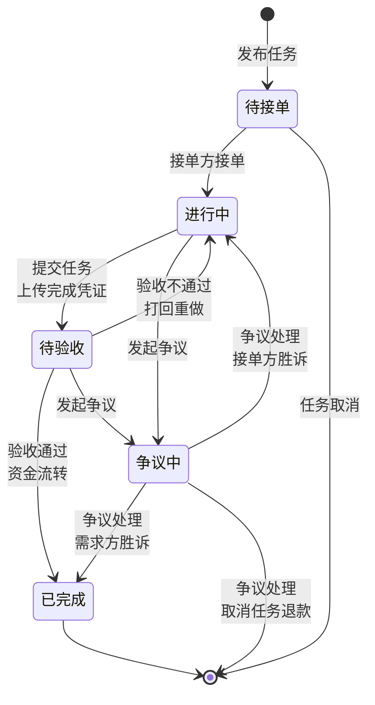

# 校园万事达互助众包任务平台 PRD

## 1. 产品概述

校园万事达互助众包任务平台是一个面向校园场景的任务互助平台，为学生提供便捷的任务发布与承接服务。平台通过虚拟账户系统、资金冻结机制和信用评价体系，确保交易安全可靠。

## 2. 角色定义（RBAC 权限隔离）

### 2.1 需求方（Requester）
- 发布任务
- 设置任务金额、截止时间、任务描述
- 支付报酬
- 验收任务
- 上传完成凭证（图片/文字）
- 发起争议

### 2.2 接单方（Helper）
- 浏览任务
- 接单、取消接单
- 完成任务
- 提交完成凭证
- 赚取报酬
- 发起争议

### 2.3 管理员（Admin）
- 审核违规任务
- 处理申诉和争议
- 监控平台数据
- 管理违规行为
- 系统运营管理

## 3. 任务全生命周期状态流转

### 3.1 状态定义

| 状态 | 说明 |
|------|------|
| **待接单** | 任务已发布，等待接单方承接 |
| **进行中** | 接单方已承接，平台进入担保状态 |
| **待验收** | 接单方已提交任务，等待需求方验收 |
| **已完成** | 需求方验收通过，资金流转完成 |
| **争议中** | 双方有异议，管理员介入处理 |

### 3.2 Mermaid 状态流转图

### 3.3 状态日志
- 每个状态变更必须记录日志
- 日志包含：操作人、操作时间、前后状态、备注

## 4. 核心功能模块

### 4.1 用户模块
- 用户注册/登录
- 个人信息管理
- 身份认证（校园认证）
- 信用分管理
- 团队组队功能（2-3人）

### 4.2 任务模块
- 发布任务
- 浏览任务列表
- 任务搜索与筛选
- 接单/取消接单
- 提交任务（上传完成凭证：图片/文字）
- 验收任务
- 任务评价（双向互评）
- 任务收藏与关注

### 4.3 虚拟账户与资金模块
- 用户虚拟余额账户
- 任务金额冻结机制
- 资金解冻与流转
- 收支流水记录（可追溯）
- 提现功能

### 4.4 实时通知模块
- 任务接单通知
- 状态变更通知
- 消息接收推送
- 争议处理通知
- 推荐方案：WebSocket 站内推送 / 邮件 API

### 4.5 管理模块
- 用户管理
- 任务管理
- 争议处理与仲裁
- 数据监控统计
- 违规内容审核

### 4.6 进阶功能（选做）
- 即时通讯 IM
- 地理位置就近展示（GeoHash）
- AI 辅助违规内容审核
- 其他创新功能

## 5. 业务规则

### 5.1 资金冻结规则
- 需求方发布任务时，需冻结任务金额的 100%
- 冻结金额独立管理，不可用于其他任务
- 任务完成后，冻结资金自动转给接单方
- 任务取消时，资金自动解冻退回需求方

### 5.2 结算规则
- 验收通过后，资金立即流转
- 平台收取 5% 服务费
- 接单方实际获得：任务金额 × (1 - 5%)
- 所有收支、冻结必须生成流水记录，可追溯

### 5.3 权限规则
- 未实名认证用户不可发布或承接任务
- 信用分低于 60 分的用户限制接单
- 管理员拥有所有权限
- RBAC 权限隔离

### 5.4 信用分规则
- 初始信用分：100 分
- 完成任务：+5 分
- 逾期完成：-10 分
- 恶意取消任务：-20 分
- 争议判定违约：-30 分
- 信用分低于 60 分限制接单
- 根据违约、评价动态计算

## 6. 技术要求

### 6.1 技术栈
- 技术栈不限

### 6.2 必须提交文档
- 需求分析
- 总体设计
- 详细设计
- 安装部署说明
- 测试报告
- 用户操作手册

### 6.3 开发要求
- 使用 AI 辅助设计开发
- 云文档协作，保留过程文档
- Git 进行代码管理
- 2-3 人组队，不可单人
