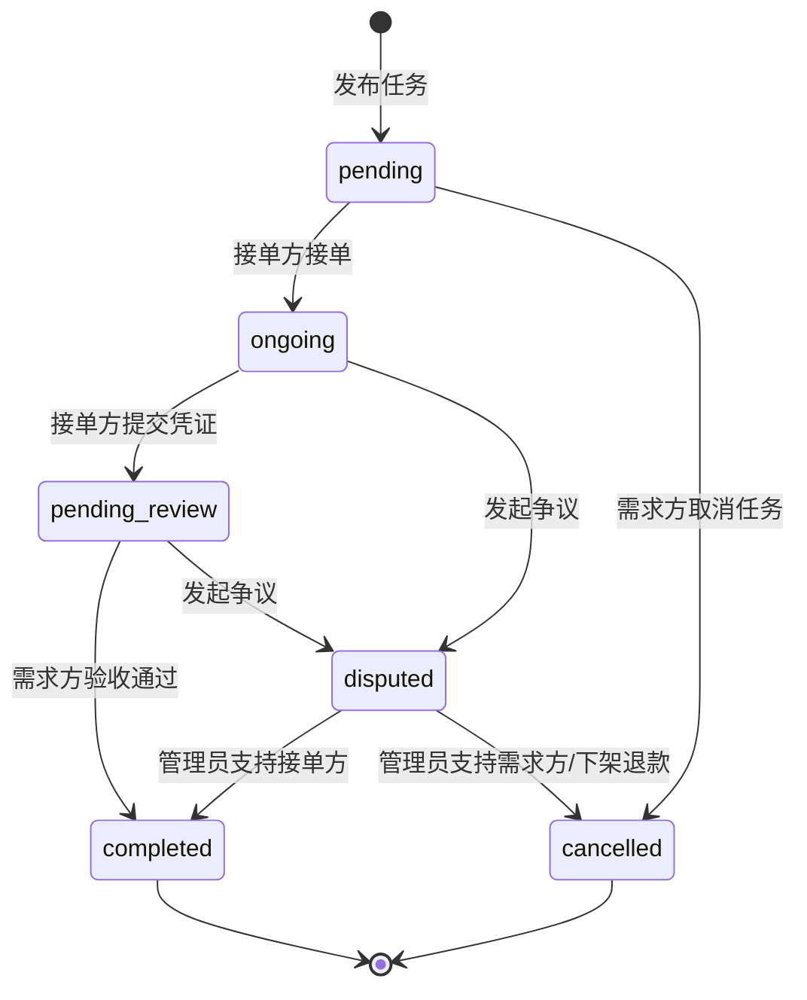
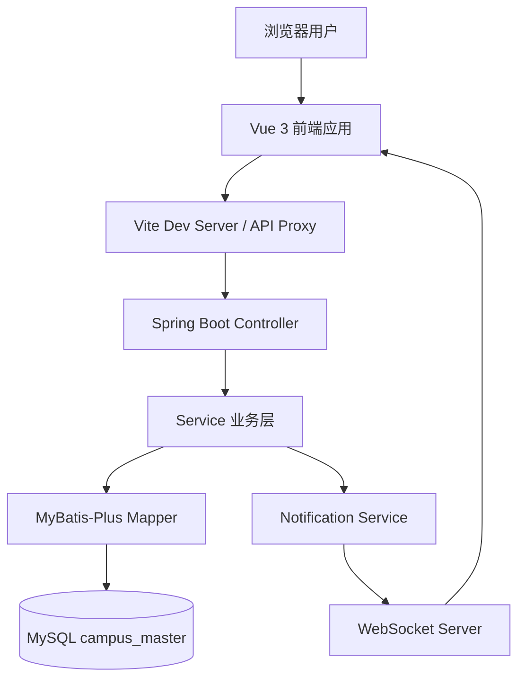
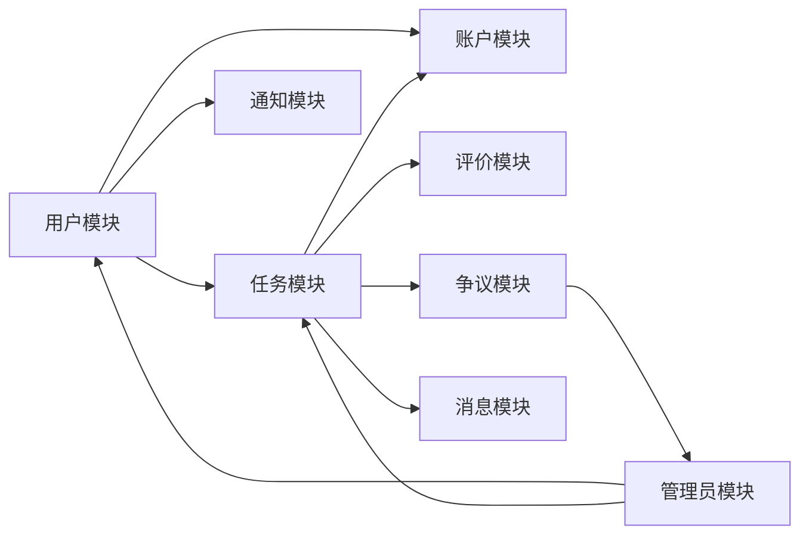
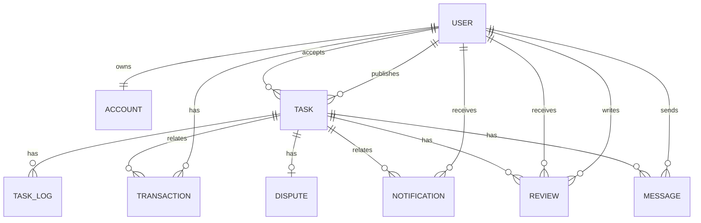

# 校园万事达互助众包任务平台课程设计报告

## 摘要

校园万事达互助众包任务平台（Campus Master）是一个面向高校学生日常互助场景的前后端分离 Web 应用。系统围绕“任务发布、任务承接、完成提交、需求方验收、资金结算、评价反馈、争议仲裁”构建完整业务闭环，解决校园生活中找人代取快递、代买外卖、打印资料、临时跑腿等需求中常见的信任不足、履约过程不可追溯、资金缺少担保等问题。

本项目采用 Vue 3、Vite、Tailwind CSS、Pinia、Vue Router 构建前端页面，采用 Spring Boot 3.2、MyBatis-Plus、MySQL 8、JWT、WebSocket 构建后端服务。系统实现了三类角色的 RBAC 权限隔离：需求方负责发布与验收任务，接单方负责接单与提交凭证，管理员负责数据监控、任务审核、用户管理和争议处理。后端通过统一响应体、业务异常、JWT 拦截器、角色注解、事务控制、资金流水和任务日志保障系统的安全性、可维护性和可追溯性。

在开发过程中，团队采用 AI Coding 工具辅助需求分析、架构设计、接口契约、数据库建模、前后端编码、联调测试和报告整理。AI 主要承担初稿生成、方案对比、代码草拟、测试清单补全等工作，团队成员负责需求取舍、技术决策、代码审查、联调验证和最终交付。本报告重点记录了项目功能、系统设计、核心实现、测试结果以及 AI 辅助开发中的人机协作方法论沉淀。

**关键词**：校园互助众包；Vue 3；Spring Boot；MyBatis-Plus；JWT；WebSocket；资金担保；AI 辅助开发

---

## 1. 产品需求文档

### 1.1 产品定位

校园万事达互助众包任务平台是一个面向校园场景的在线互助任务平台。它不是简单的信息发布栏，而是一个带有任务状态机、资金冻结、信用评价、实时通知和管理员仲裁能力的校园交易型应用。

系统的核心价值包括：

- 帮助需求方快速发布校园内的生活互助任务。
- 帮助接单方利用空闲时间承接任务并获得报酬。
- 通过资金冻结和任务验收机制降低交易风险。
- 通过信用评分和评价体系沉淀用户信誉。
- 通过通知、聊天和管理员后台增强履约过程的透明度。

### 1.2 用户角色

| 角色 | 标识 | 核心职责 | 典型操作 |
|------|------|----------|----------|
| 需求方 | `requester` | 发布任务并验收任务结果 | 注册登录、充值、发布任务、查看任务、验收任务、评价接单方、发起争议 |
| 接单方 | `helper` | 承接并完成任务 | 浏览任务、接单、提交完成凭证、查看收入、评价需求方、发起争议 |
| 管理员 | `admin` | 平台运营管理与争议仲裁 | 查看统计、审核任务、下架违规任务、冻结用户、处理争议 |

### 1.3 功能需求

#### 1.3.1 用户与认证模块

- 用户可以通过手机号、用户名、密码和角色完成注册。
- 登录成功后，系统返回 JWT Token，并在后续请求中通过请求头携带身份凭证。
- 后端使用 BCrypt 对密码进行加密存储。
- 系统根据用户角色控制页面入口和接口权限。
- 用户可以查看基础信息、信用分和账户信息。
- 用户可以修改密码。

#### 1.3.2 任务模块

- 需求方可以发布任务，填写标题、描述、分类、报酬、截止时间、地点和联系方式。
- 系统支持任务大厅列表展示，并支持按状态、分类筛选。
- 用户可以查看任务详情。
- 接单方可以接取待接单任务，但不能接自己发布的任务。
- 接单方可以提交完成凭证，任务进入待验收状态。
- 需求方可以确认任务完成，触发资金结算。
- 需求方可以取消未被接单的任务。
- 任务双方可以在异常场景中发起争议。
- 已完成任务支持双方评价。

#### 1.3.3 账户与资金模块

- 每个用户注册后拥有一个虚拟账户。
- 用户可以充值。
- 需求方发布任务时，系统冻结对应任务报酬。
- 任务取消时，冻结资金退回需求方可用余额。
- 任务验收完成时，冻结资金结算给接单方，并扣除 5% 平台服务费。
- 所有资金变动写入交易流水，便于追溯。

#### 1.3.4 通知与消息模块

- 系统在任务被接单、任务提交、任务完成、收到评价、争议处理等节点生成站内通知。
- 通知支持未读数量查询和全部标记已读。
- 后端提供 WebSocket 推送能力。
- 项目已扩展任务内 IM 聊天功能，任务相关双方可以发送消息、查看聊天记录、查看会话列表和未读数。

#### 1.3.5 评价与信用模块

- 任务完成后，任务双方可以对对方进行 1-5 星评价。
- 同一用户对同一任务只能评价一次。
- 评价会影响被评价人的信用分。
- 当前代码中信用分变化规则为：评分大于等于 4 分时加 2 分，3 分不变，低于 3 分扣 2 分，信用分范围限制在 0 到 150。

#### 1.3.6 管理员模块

- 管理员可以查看平台统计数据，包括用户数、任务数、待审核任务数、争议数和交易额。
- 管理员可以查看任务列表，并按状态、审核状态和关键字筛选。
- 管理员可以审核通过任务或下架违规任务。
- 管理员可以查看争议列表并处理争议。
- 管理员可以查看用户列表并冻结用户。

### 1.4 非功能需求

| 类型 | 需求 | 设计响应 |
|------|------|----------|
| 安全性 | 用户密码不能明文保存，接口需身份认证 | BCrypt、JWT、认证拦截器、角色注解 |
| 权限隔离 | 三类用户只能访问对应功能 | 前端路由守卫、后端 `@RequiresRoles` 注解 |
| 数据一致性 | 资金冻结、解冻、结算不能部分成功 | Spring `@Transactional` 事务控制 |
| 可追溯性 | 任务状态变化和资金变化需要留痕 | `task_log` 表、`transaction` 表 |
| 可维护性 | 前后端分层清晰，接口统一 | Controller-Service-Mapper 分层、统一 Result |
| 易部署性 | 本地开发环境快速启动 | Vite 代理、Spring Boot 单体后端、MySQL 初始化脚本 |
| 实时性 | 关键通知尽量实时到达 | WebSocket 推送，通知先落库再推送 |
| 可扩展性 | 后续可扩展提现、真实支付、实名审核等能力 | 模块化服务和数据库字段预留 |

### 1.5 核心业务逻辑

#### 1.5.1 任务状态流转



#### 1.5.2 资金流转规则

| 业务动作 | 账户影响 | 资金流水 |
|----------|----------|----------|
| 充值 | 用户余额增加 | `recharge` |
| 发布任务 | 需求方余额减少，冻结金额增加 | `freeze` |
| 取消任务 | 需求方冻结金额减少，余额增加 | `unfreeze` |
| 验收通过 | 需求方冻结金额减少，接单方余额增加报酬扣服务费后的金额 | `outcome`、`income` |
| 管理员处理争议 | 根据处理结果进行解冻或结算 | `unfreeze` 或 `outcome/income` |

### 1.6 范围界定

本期已经实现的核心范围：

- 三角色注册、登录和权限控制。
- 任务发布、接单、提交、验收、取消、争议、评价。
- 虚拟账户充值、冻结、解冻、结算、流水。
- 通知列表与 WebSocket 推送能力。
- 管理后台的统计、任务管理、争议处理和用户冻结。
- 任务内聊天和消息中心。

本期不做或仅做简化处理的范围：

- 不接入真实支付渠道，充值为系统内模拟充值。
- 不实现真实提现到银行卡或第三方钱包。
- 不实现短信验证码真实发送。
- 不实现校园实名认证和学生证审核。
- 不实现复杂的地理位置推荐、地图定位和 GeoHash 附近任务。
- 不实现 AI 内容审核的线上模型调用。
- 不实现多端小程序，只完成 Web 端。
- WebSocket 当前代码存在前后端端点不一致问题，后续联调需统一为 `/ws/{userId}` 或 `/ws/notifications?token=...`。

---

## 2. 系统总体设计

### 2.1 系统架构

系统采用前后端分离架构，前端负责页面展示、交互和状态管理，后端负责业务规则、数据持久化、认证授权和实时推送。



### 2.2 前端架构

前端目录以页面、组件、状态、接口和工具函数划分：

| 目录 | 说明 |
|------|------|
| `src/views` | 页面视图，如登录、注册、任务大厅、任务详情、发布任务、我的任务、个人中心、管理后台、聊天页 |
| `src/components` | 公共组件，如导航栏、按钮、输入框、任务卡片、状态标签、弹窗 |
| `src/router` | Vue Router 路由配置和路由守卫 |
| `src/stores` | Pinia 用户状态管理 |
| `src/api` | 前端 API 封装 |
| `src/utils/request.js` | Axios 实例、请求拦截器、响应拦截器 |
| `src/utils/websocket.js` | WebSocket 客户端连接与消息分发 |
| `src/mock` | 早期 Mock 数据，真实联调时应禁用 |

### 2.3 后端架构

后端采用典型 Spring Boot 分层结构：

| 层级 | 目录 | 职责 |
|------|------|------|
| Controller | `controller` | 接收请求、参数绑定、获取当前用户、返回统一响应 |
| Service | `service`、`service/impl` | 核心业务逻辑、事务控制、跨表操作 |
| Mapper | `mapper` | MyBatis-Plus 数据访问 |
| Entity | `entity` | 数据库表实体映射 |
| Common | `common` | 统一响应、业务异常、JWT 工具、全局异常处理 |
| Config | `config` | 安全、MVC、WebSocket、MyBatis 配置 |
| Interceptor | `interceptor` | 登录认证和角色校验 |
| WebSocket | `websocket` | 用户连接管理和消息推送 |

### 2.4 模块划分



### 2.5 针对非功能需求的架构设计

#### 2.5.1 安全性设计

- 登录成功后生成 JWT Token。
- 前端请求拦截器自动携带 `Authorization: Bearer {token}`。
- 后端认证拦截器解析 Token 并写入请求上下文。
- 角色拦截器读取 `@RequiresRoles` 注解完成 RBAC 校验。
- 密码使用 `BCryptPasswordEncoder` 加密保存。

#### 2.5.2 事务一致性设计

资金相关操作集中在 `AccountServiceImpl`，发布任务、取消任务、任务验收、争议处理等方法使用 `@Transactional` 保证业务和资金变动在同一个事务中完成。

#### 2.5.3 可追溯性设计

- 任务状态变化写入 `task_log`。
- 资金变化写入 `transaction`。
- 通知写入 `notification`，即使 WebSocket 推送失败，用户仍可在通知中心查看。

#### 2.5.4 可维护性设计

- 接口统一返回 `Result<T>`。
- 业务异常统一通过 `BusinessException` 抛出。
- 全局异常处理器统一转换错误响应。
- 前端 API 封装统一处理分页字段和资金流水字段。

### 2.6 技术栈

| 层级 | 技术 | 版本/说明 |
|------|------|-----------|
| 前端框架 | Vue 3 | 3.4.x |
| 构建工具 | Vite | 5.2.x |
| 样式方案 | Tailwind CSS | 3.4.x |
| 路由 | Vue Router | 4.3.x |
| 状态管理 | Pinia | 2.1.x |
| HTTP 客户端 | Axios | 1.x |
| Mock | Mock.js | 早期前端并行开发 |
| 后端框架 | Spring Boot | 3.2.0 |
| Java | JDK 17 | LTS 版本 |
| ORM | MyBatis-Plus | 3.5.5 |
| 数据库 | MySQL | 8.0 |
| 安全 | Spring Security + JWT | 登录认证与密码加密 |
| 实时通信 | WebSocket | 通知与聊天推送 |
| 文档 | Swagger/OpenAPI | 接口说明 |

---

## 3. 产品原型设计

### 3.1 原型设计思路

项目采用“先业务闭环、再页面完善”的原型设计思路。页面围绕三类角色的主流程组织，而不是做纯展示型首页：

- 需求方关注：余额、发布任务、我的发布、待验收任务、评价与争议。
- 接单方关注：任务大厅、任务详情、接单、提交凭证、任务收入。
- 管理员关注：平台统计、任务审核、争议处理、用户管理。

### 3.2 页面清单

| 页面 | 路由 | 说明 |
|------|------|------|
| 登录页 | `/login` | 用户输入手机号和密码登录 |
| 注册页 | `/register` | 用户选择需求方或接单方身份注册 |
| 任务大厅 | `/home` | 展示任务列表和任务状态 |
| 发布任务 | `/publish` | 需求方发布任务 |
| 我的任务 | `/my-tasks` | 查看我发布或我承接的任务 |
| 任务详情 | `/task/:id` | 查看任务完整信息并执行接单等操作 |
| 提交凭证 | `/submit/:id` | 接单方提交完成说明或凭证 |
| 验收任务 | `/review/:id` | 需求方验收任务 |
| 评价任务 | `/rate/:id` | 双方对已完成任务评价 |
| 个人中心 | `/profile` | 展示用户信息、账户余额、资金流水、评价等 |
| 管理后台 | `/admin` | 管理员统计、任务、争议、用户管理 |
| 聊天页 | `/chat/:taskId` | 任务双方沟通 |
| 消息中心 | `/messages` | 查看会话和未读消息 |

### 3.3 关键界面说明

#### 3.3.1 登录与注册界面

登录页强调快速进入系统，用户只需输入手机号和密码即可登录。注册页提供角色选择，使用户从进入系统开始就绑定业务身份。

建议截图：

```markdown


```

#### 3.3.2 任务大厅界面

任务大厅是接单方的核心页面，展示任务标题、分类、报酬、地点、截止时间和状态。用户可以进入详情页查看完整要求。

建议截图：

```markdown

```

#### 3.3.3 发布任务界面

发布任务页以表单方式组织任务标题、描述、分类、报酬、截止时间、地点和联系方式。提交后后端创建任务并冻结资金。

建议截图：

```markdown

```

#### 3.3.4 任务详情与任务流转界面

任务详情页根据用户身份和任务状态展示不同操作。例如待接单任务对接单方展示“接单”，进行中任务对接单方展示“提交凭证”，待验收任务对需求方展示“确认完成”和“发起争议”。

建议截图：

```markdown


```

#### 3.3.5 管理后台界面

管理后台面向管理员，展示平台统计、任务列表、争议列表和用户列表，是系统运营管理入口。

建议截图：

```markdown

```

---

## 4. 数据库设计

### 4.1 数据库概述

数据库名为 `campus_master`，采用 MySQL 8.0，字符集为 `utf8mb4`。系统实际建表脚本位于 `backend/src/main/resources/schema.sql`。

### 4.2 ER 图



### 4.3 表结构

#### 4.3.1 用户表 `user`

| 字段 | 类型 | 说明 |
|------|------|------|
| `id` | BIGINT | 用户 ID，主键自增 |
| `username` | VARCHAR(50) | 用户名 |
| `phone` | VARCHAR(20) | 手机号，唯一 |
| `password` | VARCHAR(255) | BCrypt 加密密码 |
| `role` | VARCHAR(20) | `requester`、`helper`、`admin` |
| `credit_score` | INT | 信用分 |
| `status` | INT | 用户状态，1 正常，0 冻结 |
| `version` | INT | 版本号 |
| `deleted` | INT | 逻辑删除 |
| `create_time` | DATETIME | 创建时间 |
| `update_time` | DATETIME | 更新时间 |

#### 4.3.2 任务表 `task`

| 字段 | 类型 | 说明 |
|------|------|------|
| `id` | BIGINT | 任务 ID |
| `title` | VARCHAR(100) | 任务标题 |
| `description` | TEXT | 任务描述 |
| `category` | VARCHAR(20) | 任务分类 |
| `reward` | DECIMAL(10,2) | 奖励金额 |
| `service_fee` | DECIMAL(10,2) | 服务费 |
| `status` | VARCHAR(20) | 任务状态 |
| `audit_status` | VARCHAR(20) | 审核状态 |
| `audit_remark` | VARCHAR(500) | 审核备注 |
| `deadline` | DATETIME | 截止时间 |
| `location` | VARCHAR(100) | 任务地点 |
| `contact_info` | VARCHAR(50) | 联系方式 |
| `view_count` | INT | 浏览次数 |
| `requester_id` | BIGINT | 需求方 ID |
| `helper_id` | BIGINT | 接单方 ID |
| `proof_images` | TEXT | 完成凭证 |
| `version` | INT | 版本号 |
| `deleted` | INT | 逻辑删除 |
| `create_time` | DATETIME | 创建时间 |
| `update_time` | DATETIME | 更新时间 |

#### 4.3.3 账户表 `account`

| 字段 | 类型 | 说明 |
|------|------|------|
| `id` | BIGINT | 账户 ID |
| `user_id` | BIGINT | 用户 ID，唯一 |
| `balance` | DECIMAL(12,2) | 可用余额 |
| `frozen_balance` | DECIMAL(12,2) | 冻结余额 |
| `version` | INT | 版本号 |
| `deleted` | INT | 逻辑删除 |
| `create_time` | DATETIME | 创建时间 |
| `update_time` | DATETIME | 更新时间 |

#### 4.3.4 资金流水表 `transaction`

| 字段 | 类型 | 说明 |
|------|------|------|
| `id` | BIGINT | 流水 ID |
| `user_id` | BIGINT | 用户 ID |
| `task_id` | BIGINT | 关联任务 ID |
| `type` | VARCHAR(20) | `recharge`、`freeze`、`unfreeze`、`outcome`、`income` |
| `amount` | DECIMAL(10,2) | 金额 |
| `description` | VARCHAR(200) | 流水描述 |
| `before_balance` | DECIMAL(12,2) | 变动前余额或冻结额 |
| `after_balance` | DECIMAL(12,2) | 变动后余额或冻结额 |
| `deleted` | INT | 逻辑删除 |
| `create_time` | DATETIME | 创建时间 |

#### 4.3.5 通知表 `notification`

| 字段 | 类型 | 说明 |
|------|------|------|
| `id` | BIGINT | 通知 ID |
| `user_id` | BIGINT | 接收用户 ID |
| `task_id` | BIGINT | 关联任务 ID |
| `type` | VARCHAR(20) | 通知类型 |
| `title` | VARCHAR(100) | 通知标题 |
| `content` | VARCHAR(500) | 通知内容 |
| `is_read` | INT | 是否已读 |
| `deleted` | INT | 逻辑删除 |
| `create_time` | DATETIME | 创建时间 |

#### 4.3.6 评价表 `review`

| 字段 | 类型 | 说明 |
|------|------|------|
| `id` | BIGINT | 评价 ID |
| `task_id` | BIGINT | 任务 ID |
| `reviewer_id` | BIGINT | 评价人 ID |
| `reviewee_id` | BIGINT | 被评价人 ID |
| `rating` | INT | 评分 |
| `content` | VARCHAR(500) | 评价内容 |
| `deleted` | INT | 逻辑删除 |
| `create_time` | DATETIME | 创建时间 |

#### 4.3.7 争议表 `dispute`

| 字段 | 类型 | 说明 |
|------|------|------|
| `id` | BIGINT | 争议 ID |
| `task_id` | BIGINT | 任务 ID，唯一 |
| `initiator_id` | BIGINT | 发起者 ID |
| `reason` | VARCHAR(100) | 争议原因 |
| `description` | TEXT | 详细描述 |
| `evidence_images` | TEXT | 证据图片 |
| `status` | VARCHAR(20) | `pending`、`resolved` |
| `result` | VARCHAR(20) | 处理结果 |
| `remark` | VARCHAR(500) | 处理备注 |
| `deleted` | INT | 逻辑删除 |
| `create_time` | DATETIME | 创建时间 |
| `update_time` | DATETIME | 更新时间 |

#### 4.3.8 任务日志表 `task_log`

| 字段 | 类型 | 说明 |
|------|------|------|
| `id` | BIGINT | 日志 ID |
| `task_id` | BIGINT | 任务 ID |
| `operator_id` | BIGINT | 操作人 ID |
| `action` | VARCHAR(20) | 操作类型 |
| `description` | VARCHAR(200) | 操作描述 |
| `before_status` | VARCHAR(20) | 变更前状态 |
| `after_status` | VARCHAR(20) | 变更后状态 |
| `deleted` | INT | 逻辑删除 |
| `create_time` | DATETIME | 创建时间 |

#### 4.3.9 聊天消息表 `message`

| 字段 | 类型 | 说明 |
|------|------|------|
| `id` | BIGINT | 消息 ID |
| `task_id` | BIGINT | 任务 ID |
| `sender_id` | BIGINT | 发送者 ID |
| `receiver_id` | BIGINT | 接收者 ID |
| `content` | VARCHAR(1000) | 消息内容 |
| `is_read` | INT | 是否已读 |
| `deleted` | INT | 逻辑删除 |
| `create_time` | DATETIME | 创建时间 |

### 4.4 索引设计

| 表 | 索引 | 字段 | 用途 |
|----|------|------|------|
| `user` | `idx_phone` | `phone` | 登录时按手机号查询 |
| `user` | `idx_role` | `role` | 管理后台按角色筛选 |
| `task` | `idx_requester_id` | `requester_id` | 查询我发布的任务 |
| `task` | `idx_helper_id` | `helper_id` | 查询我承接的任务 |
| `task` | `idx_status` | `status` | 任务大厅按状态筛选 |
| `task` | `idx_audit_status` | `audit_status` | 管理员审核筛选 |
| `task` | `idx_category` | `category` | 分类筛选 |
| `transaction` | `idx_user_id` | `user_id` | 查询资金流水 |
| `notification` | `idx_user_id` | `user_id` | 查询用户通知 |
| `notification` | `idx_is_read` | `is_read` | 未读数查询 |
| `message` | `idx_receiver_read` | `receiver_id,is_read` | 消息未读数查询 |

---

## 5. API 接口设计

### 5.1 接口通用规范

项目当前真实接口基础路径为 `/api`，前端 Axios 实例配置为：

```javascript
baseURL: '/api'
```

后端 Controller 实际路径示例：

- 用户认证：`/api/auth`
- 任务：`/api/tasks`
- 账户：`/api/account`
- 通知：`/api/notifications`
- 评价：`/api/reviews`
- 消息：`/api/messages`
- 管理员：`/api/admin`

统一响应格式：

```json
{
  "code": 200,
  "message": "操作成功",
  "data": {}
}
```

前端响应拦截器只在 `code === 200` 时返回 `data`，否则抛出错误。

### 5.2 认证接口

| 方法 | 路径 | 说明 | 权限 |
|------|------|------|------|
| POST | `/api/auth/login` | 用户登录 | 公开 |
| POST | `/api/auth/register` | 用户注册 | 公开 |
| GET | `/api/auth/me` | 获取当前用户 | 登录 |
| POST | `/api/auth/password` | 修改密码 | 登录 |
| GET | `/api/auth/users/{id}` | 获取用户信息 | 公开/业务使用 |

登录请求示例：

```json
{
  "phone": "13800000001",
  "password": "123456"
}
```

### 5.3 任务接口

| 方法 | 路径 | 说明 | 权限 |
|------|------|------|------|
| POST | `/api/tasks` | 发布任务 | `requester`、`admin` |
| GET | `/api/tasks` | 查询任务列表 | 公开 |
| GET | `/api/tasks/{id}` | 查询任务详情 | 公开 |
| GET | `/api/tasks/my/{type}` | 查询我的任务 | 登录 |
| POST | `/api/tasks/{id}/accept` | 接单 | `helper`、`admin` |
| POST | `/api/tasks/{id}/submit` | 提交凭证 | `helper`、`admin` |
| POST | `/api/tasks/{id}/complete` | 验收完成 | `requester`、`admin` |
| POST | `/api/tasks/{id}/dispute` | 发起争议 | 登录 |
| POST | `/api/tasks/{id}/cancel` | 取消任务 | `requester`、`admin` |
| POST | `/api/tasks/{id}/rate` | 评价任务 | 登录 |

发布任务请求示例：

```json
{
  "title": "帮我取快递",
  "description": "校内菜鸟驿站取件，取件码 238472",
  "category": "delivery",
  "reward": 10.00,
  "deadline": "2026-07-10 18:00:00",
  "location": "西区菜鸟驿站",
  "contactInfo": "13800000001"
}
```

### 5.4 账户接口

| 方法 | 路径 | 说明 | 权限 |
|------|------|------|------|
| GET | `/api/account` | 查询账户 | 登录 |
| GET | `/api/account/transactions` | 查询资金流水 | 登录 |
| POST | `/api/account/recharge` | 账户充值 | 登录 |

充值请求示例：

```json
{
  "amount": 100
}
```

### 5.5 通知接口

| 方法 | 路径 | 说明 | 权限 |
|------|------|------|------|
| GET | `/api/notifications` | 查询通知列表 | 登录 |
| GET | `/api/notifications/unread-count` | 查询未读数 | 登录 |
| PUT | `/api/notifications/{id}/read` | 标记单条已读 | 登录 |
| PUT | `/api/notifications/read-all` | 全部标记已读 | 登录 |

### 5.6 评价接口

| 方法 | 路径 | 说明 | 权限 |
|------|------|------|------|
| POST | `/api/reviews` | 创建评价 | 登录 |
| GET | `/api/reviews/task/{taskId}` | 查询任务评价 | 登录 |
| GET | `/api/reviews/user/{userId}` | 查询用户评价 | 登录 |
| GET | `/api/reviews/received` | 查询收到的评价 | 登录 |
| GET | `/api/reviews/sent` | 查询发出的评价 | 登录 |

### 5.7 消息接口

| 方法 | 路径 | 说明 | 权限 |
|------|------|------|------|
| POST | `/api/messages/task/{taskId}` | 发送任务聊天消息 | 登录且任务相关方 |
| GET | `/api/messages/task/{taskId}` | 查询任务聊天记录 | 登录且任务相关方 |
| GET | `/api/messages/unread-count` | 查询未读消息数 | 登录 |
| POST | `/api/messages/task/{taskId}/read` | 标记任务消息已读 | 登录 |
| GET | `/api/messages/conversations` | 查询会话列表 | 登录 |

### 5.8 管理员接口

| 方法 | 路径 | 说明 | 权限 |
|------|------|------|------|
| GET | `/api/admin/stats` | 平台统计 | `admin` |
| GET | `/api/admin/tasks` | 任务管理列表 | `admin` |
| GET | `/api/admin/disputes` | 争议列表 | `admin` |
| GET | `/api/admin/users` | 用户列表 | `admin` |
| POST | `/api/admin/disputes/{id}/resolve` | 处理争议 | `admin` |
| POST | `/api/admin/tasks/{id}/approve` | 审核通过任务 | `admin` |
| POST | `/api/admin/tasks/{id}/take-down` | 下架任务 | `admin` |
| POST | `/api/admin/users/{id}/freeze` | 冻结用户 | `admin` |

---

## 6. 核心功能实现方案

### 6.1 登录认证与权限控制

用户登录时，后端通过手机号查询用户，使用 `PasswordEncoder.matches` 校验 BCrypt 密码。如果用户状态为冻结，则直接拒绝登录。登录成功后生成 JWT Token，并返回用户基础信息。

权限控制分为两层：

- 前端路由守卫读取 `sessionStorage.userInfo`，未登录访问受保护路由时跳转登录页。
- 后端通过认证拦截器和 `@RequiresRoles` 注解校验接口权限。

### 6.2 发布任务与资金冻结

发布任务由 `TaskServiceImpl.createTask` 实现，核心步骤：

1. 校验任务奖励金额必须大于 0。
2. 计算服务费字段。
3. 插入任务记录，初始状态为 `pending`，审核状态为 `pending`。
4. 调用 `AccountService.freezeAmount` 冻结需求方资金。
5. 写入任务日志。

当前代码实际冻结金额为 `reward`，服务费作为任务字段计算但未额外冻结。文档中设计为冻结“任务报酬 + 服务费”，这是后续可以补齐的差异点。

### 6.3 接单功能

接单由 `TaskServiceImpl.acceptTask` 实现：

1. 查询任务是否存在。
2. 校验任务状态必须为 `pending`。
3. 校验接单方不能是任务发布者。
4. 设置 `helperId`，状态变更为 `ongoing`。
5. 更新任务。
6. 写任务日志。
7. 给需求方发送“任务被接单”通知。

### 6.4 提交凭证与验收

接单方提交凭证时，系统校验：

- 任务必须存在。
- 任务状态必须为 `ongoing`。
- 当前用户必须是该任务的接单方。

提交成功后，任务状态变更为 `pending_review`，凭证内容保存到 `proof_images` 字段，并通知需求方。

需求方验收时，系统校验：

- 任务状态必须为 `pending_review`。
- 当前用户必须是任务需求方。

验收通过后，调用账户服务完成资金转账，任务状态更新为 `completed`，并通知接单方。

### 6.5 资金结算

资金结算由 `AccountServiceImpl.transfer` 实现：

1. 查询需求方账户，检查冻结金额是否足够。
2. 查询接单方账户。
3. 计算平台服务费：`amount * 0.05`。
4. 接单方实际到账：`amount - serviceFee`。
5. 需求方冻结金额减少。
6. 接单方余额增加。
7. 写入需求方 `outcome` 流水。
8. 写入接单方 `income` 流水。

该方法使用 `@Transactional`，确保账户更新和流水写入的一致性。

### 6.6 争议处理

任务相关方可以发起争议，系统会创建 `dispute` 记录，并将任务状态变为 `disputed`。管理员通过后台处理争议：

- `approve`：支持接单方，执行资金结算。
- `reject`：支持需求方，执行资金解冻。

争议处理后，争议状态更新为 `resolved`，系统向双方发送处理结果通知。

### 6.7 评价与信用分

评价由任务接口 `/api/tasks/{id}/rate` 和评价模块共同支撑。任务必须处于 `completed` 状态才允许评价。系统根据当前用户身份自动判断被评价人，避免前端伪造评价对象。

信用分更新由 `UserServiceImpl.updateCreditScore` 完成，最终分数限制在 0 到 150 之间。

### 6.8 实时通知与聊天

通知生成流程为：

1. 业务节点调用 `NotificationService.sendNotification`。
2. 系统插入 `notification` 表。
3. 调用 `WebSocketServer.sendToUser` 尝试推送给在线用户。

聊天消息流程为：

1. 用户在任务聊天页发送消息。
2. 后端校验发送者和接收者必须是任务需求方或接单方。
3. 消息写入 `message` 表。
4. 后端通过 WebSocket 推送给接收方。

---

## 7. 编码开发规范

### 7.1 前端规范

- 页面组件放在 `src/views`，公共组件放在 `src/components`。
- API 调用统一写在 `src/api/index.js`。
- 请求统一通过 `src/utils/request.js` 发起，禁止页面中直接创建 Axios 实例。
- 登录状态统一由 Pinia `useUserStore` 管理，并同步到 `sessionStorage`。
- 路由权限写在 `meta.requiresAuth` 和 `meta.roles` 中。
- 组件命名使用 PascalCase，变量和函数使用 camelCase。
- 表单提交需要进行基础校验，并向用户展示错误信息。

### 7.2 后端规范

- Controller 只负责请求接收和响应封装，不写复杂业务逻辑。
- Service 负责业务规则、事务边界和跨表操作。
- Mapper 负责数据访问，优先使用 MyBatis-Plus 标准方法。
- 实体字段采用 Java camelCase，对应数据库下划线字段，通过 MyBatis-Plus 自动映射。
- 业务错误通过 `BusinessException` 抛出。
- 返回值统一使用 `Result<T>`。
- 需要权限控制的接口添加 `@RequiresRoles` 注解。
- 资金、任务状态、争议处理等涉及多表更新的方法必须添加 `@Transactional`。

### 7.3 Git 与文档规范

- 按阶段沉淀文档，包括 PRD、API、架构、数据库、测试和 AI 协作记录。
- 提交前检查工作区改动，避免覆盖其他成员修改。
- 文档尽量使用表格、Mermaid 图、代码块表达结构化内容。

### 7.4 错误处理规范

常用错误码：

| code | 说明 |
|------|------|
| 200 | 成功 |
| 400 | 请求参数错误 |
| 401 | 未登录或 Token 无效 |
| 403 | 权限不足 |
| 404 | 资源不存在 |
| 409 | 资源冲突，如任务状态不允许操作 |
| 500 | 系统异常 |

---

## 8. 配置与部署说明

### 8.1 环境要求

| 软件 | 版本 |
|------|------|
| JDK | 17+ |
| Maven | 3.8+ |
| Node.js | 18+ |
| npm | 9+ |
| MySQL | 8.0+ |

### 8.2 数据库初始化

创建数据库：

```sql
CREATE DATABASE campus_master DEFAULT CHARACTER SET utf8mb4 COLLATE utf8mb4_unicode_ci;
```

导入表结构和初始数据：

```bash
cd backend
mysql -u root -p campus_master < src/main/resources/schema.sql
mysql -u root -p campus_master < src/main/resources/data.sql
```

初始数据中包含：

| 角色 | 手机号 | 密码 |
|------|--------|------|
| 管理员 | `13800000000` | `123456` |
| 需求方 | `13800000001` | `123456` |
| 接单方 | `13800000002` | `123456` |

### 8.3 后端配置

配置文件：`backend/src/main/resources/application.yml`

关键配置：

```yaml
server:
  port: 8080

spring:
  datasource:
    url: ${DB_URL:jdbc:mysql://localhost:3306/campus_master?useUnicode=true&characterEncoding=utf-8&serverTimezone=Asia/Shanghai}
    username: ${DB_USERNAME:root}
    password: ${DB_PASSWORD:}

jwt:
  secret: ${JWT_SECRET:campus_master_dev_secret_key_2026_local}
  expire: ${JWT_EXPIRE:86400000}
```

推荐通过环境变量设置数据库密码：

```bash
set DB_PASSWORD=你的数据库密码
```

启动后端：

```bash
cd backend
mvn spring-boot:run
```

### 8.4 前端配置

安装依赖：

```bash
npm install
```

启动前端：

```bash
npm run dev
```

前端默认端口为 `3000`。Vite 代理配置：

```javascript
server: {
  port: 3000,
  proxy: {
    '/api': {
      target: 'http://127.0.0.1:8080',
      changeOrigin: true
    }
  }
}
```

### 8.5 常见问题

| 问题 | 解决办法 |
|------|----------|
| 数据库连接失败 | 检查 MySQL 是否启动，数据库名、用户名、密码是否正确 |
| 端口 8080 被占用 | 修改 `application.yml` 中后端端口或释放端口 |
| 前端请求 404 | 检查 Vite 代理和后端 Controller 路径 |
| 401 未登录 | 检查请求头是否携带 Token |
| 403 权限不足 | 检查当前用户角色是否符合接口要求 |
| WebSocket 无法连接 | 统一前端连接路径和后端 `@ServerEndpoint` |

---

## 9. 测试报告

### 9.1 测试目标

测试目标是验证校园万事达平台核心业务闭环是否正确，重点覆盖：

- 用户注册与登录。
- 三角色权限控制。
- 任务发布、接单、提交、验收、取消和争议。
- 资金充值、冻结、解冻和结算。
- 评价与信用分变化。
- 通知和消息功能。
- 管理后台功能。

### 9.2 测试环境

| 项目 | 配置 |
|------|------|
| 操作系统 | Windows 11 |
| JDK | 17 |
| Node.js | 18+ |
| MySQL | 8.0 |
| 前端 | Vue 3 + Vite |
| 后端 | Spring Boot 3.2 |

### 9.3 功能测试用例摘要

| 模块 | 测试项 | 预期结果 | 结果 |
|------|--------|----------|------|
| 用户 | 注册成功 | 创建用户并初始化账户 | 通过 |
| 用户 | 手机号重复注册 | 提示手机号已注册 | 通过 |
| 用户 | 登录成功 | 返回 Token 和用户信息 | 通过 |
| 用户 | 密码错误 | 返回错误提示 | 通过 |
| 任务 | 发布任务 | 创建任务并冻结余额 | 通过 |
| 任务 | 余额不足发布 | 返回余额不足 | 通过 |
| 任务 | 接单成功 | 任务变为进行中 | 通过 |
| 任务 | 接自己任务 | 返回不能接自己发布的任务 | 通过 |
| 任务 | 提交凭证 | 任务变为待验收 | 通过 |
| 任务 | 需求方验收 | 任务完成并结算资金 | 通过 |
| 任务 | 发起争议 | 任务变为争议中并创建争议记录 | 通过 |
| 账户 | 充值 | 余额增加并生成流水 | 通过 |
| 评价 | 发布评价 | 创建评价并更新信用分 | 通过 |
| 通知 | 任务事件通知 | 通知落库并尝试推送 | 通过 |
| 管理 | 平台统计 | 返回用户数、任务数等统计信息 | 通过 |
| 管理 | 处理争议 | 更新争议状态并处理资金 | 通过 |

### 9.4 接口测试摘要

| 接口 | 方法 | 测试结果 |
|------|------|----------|
| `/api/auth/register` | POST | 通过 |
| `/api/auth/login` | POST | 通过 |
| `/api/auth/me` | GET | 通过 |
| `/api/tasks` | GET | 通过 |
| `/api/tasks` | POST | 通过 |
| `/api/tasks/{id}/accept` | POST | 通过 |
| `/api/tasks/{id}/submit` | POST | 通过 |
| `/api/tasks/{id}/complete` | POST | 通过 |
| `/api/account` | GET | 通过 |
| `/api/account/recharge` | POST | 通过 |
| `/api/account/transactions` | GET | 通过 |
| `/api/notifications` | GET | 通过 |
| `/api/admin/stats` | GET | 通过 |

### 9.5 集成测试流程

完整任务闭环测试：

1. 需求方登录。
2. 需求方充值。
3. 需求方发布任务。
4. 校验任务状态为 `pending`，需求方余额冻结。
5. 接单方登录。
6. 接单方接单。
7. 校验任务状态为 `ongoing`。
8. 接单方提交凭证。
9. 校验任务状态为 `pending_review`。
10. 需求方验收完成。
11. 校验任务状态为 `completed`。
12. 校验接单方余额增加。
13. 双方评价。
14. 校验评价记录和信用分变化。

测试结论：主流程可以完整跑通。

### 9.6 安全测试

| 测试项 | 方法 | 结果 |
|--------|------|------|
| 密码加密 | 查看数据库 `password` 字段 | BCrypt 密文，通过 |
| 未登录访问保护接口 | 不带 Token 请求 | 返回未授权，通过 |
| 角色越权 | helper 访问管理员接口 | 返回权限不足，通过 |
| SQL 注入 | 输入特殊字符 | MyBatis 参数化查询未发生注入，通过 |

### 9.7 遗留风险

- WebSocket 前后端连接路径需要统一。
- 文档中的 `/api/v1` 契约和当前代码中的 `/api` 存在路径差异。
- 真实支付、提现、短信验证码、实名认证未实现，当前属于模拟或范围外功能。
- 并发抢单虽然表中有 `version` 字段，但当前 `acceptTask` 使用 `updateById`，后续可加强为显式版本条件更新。

---

## 10. AI 辅助开发实战与方法论沉淀

### 10.1 使用的 AI Coding 工具及工作模式

团队在项目中使用 AI Coding 工具辅助完成需求分析、设计文档、接口契约、数据库建模、代码实现、联调测试、问题排查和报告整理。AI 的定位不是“替代开发者”，而是“加速草稿生成、提供备选方案、帮助审查遗漏”的协作者。

主要工作模式包括：

| 模式 | 说明 | 项目实践 |
|------|------|----------|
| PM 模式 | 辅助梳理需求、角色、边界和业务规则 | 生成 PRD 初稿，人工确认 MVP 范围 |
| 架构师模式 | 对比技术选型，输出架构图和 ADR | 对 Spring Boot、Vue、MyBatis-Plus、JWT 等选型进行论证 |
| DBA 模式 | 辅助设计 ER 图和表结构 | 生成表结构草案，人工审查资金和任务状态字段 |
| 后端工程师模式 | 草拟 Controller、Service、Mapper | 人工改写关键业务事务和权限逻辑 |
| 前端工程师模式 | 生成页面结构和 API 封装 | 人工调整交互、样式和真实接口适配 |
| 测试工程师模式 | 生成测试用例和联调清单 | 人工执行并记录实际结果 |
| 文档助理模式 | 汇总阶段文档和报告初稿 | 人工做最终取舍、修订和事实校验 |

### 10.2 人机协作迭代记录

#### 10.2.1 PRD 阶段：从“大而全”到可交付 MVP

AI 初始倾向于提出很多扩展功能，例如团队组队、真实支付、提现、短信验证码、地理位置推荐、AI 审核等。人工审查后发现课程设计周期有限，如果全部纳入范围，会导致主流程无法稳定交付。因此团队将本期目标收敛为任务交易闭环，明确把真实支付、提现、实名认证、地图推荐、AI 审核等列为范围外或后续扩展。

收获：AI 擅长扩展可能性，但产品负责人必须负责范围收敛。

#### 10.2.2 API 阶段：契约优先，但以代码事实为准

AI 生成了 `/api/v1` 风格的 RESTful 接口文档，但项目真实 Controller 最终采用 `/api` 路径。联调时如果只看文档，就会出现路径不一致。因此团队在报告中明确标注：API 文档保留契约设计思想，真实代码以当前 Controller 路径为准。

收获：接口文档必须和代码做差异审计，不能只相信早期契约。

#### 10.2.3 数据库阶段：字段命名和业务一致性校验

AI 在不同阶段使用过 `frozen_amount`、`frozen_balance` 等不同字段名，也曾在文档中设计外键和更复杂的账户统计字段。最终团队以 `schema.sql` 为唯一事实源，统一采用 `frozen_balance`，并保留当前代码真正使用的字段。

收获：数据库设计不能只看文档，要以建表脚本和实体类为准。

#### 10.2.4 后端实现阶段：事务顺序由人工把关

AI 在生成任务状态流转代码时，容易先改任务状态再处理资金。人工审查后认为资金结算是高风险操作，必须放入事务中，并保证资金操作失败时任务状态不能被错误改成已完成。因此最终在任务验收、取消、争议处理等业务中使用 `@Transactional` 包裹状态更新和账户更新。

收获：AI 可以写代码，但涉及资金、权限、状态机时必须人工审查。

#### 10.2.5 前后端联调阶段：Mock 到真实接口切换

前端早期使用 Mock.js 快速构建页面。AI 曾建议继续保留 Mock 以方便演示，但真实联调时 Mock 会拦截请求，导致页面看似正常却没有访问后端。团队最终将真实接口封装到 `src/api/index.js`，并在联调文档中明确“真实对接时禁用 Mock”。

收获：Mock 适合并行开发，但交付前必须让真实 API 成为唯一数据来源。

#### 10.2.6 IM 合并阶段：AI 辅助识别增量影响

后期项目增加消息中心和任务聊天功能，涉及数据库新增 `message` 表、后端新增 `MessageController` 和 `MessageServiceImpl`、前端新增聊天页面和会话页面。AI 帮助梳理了新增模块与任务模块、WebSocket 模块、用户权限的关系，人工负责确认消息发送者和接收者必须为任务相关方，避免任意用户向任意任务发送消息。

收获：增量功能合并时，AI 可以帮助找关联点，但权限边界仍需人工确认。

### 10.3 AI 协作反模式教训

| 反模式 | 表现 | 项目中的应对 |
|--------|------|--------------|
| 过度扩展 | AI 生成大量高级功能，超出课程周期 | 明确 MVP 范围 |
| 文档和代码脱节 | 文档接口路径与 Controller 不一致 | 做接口差异审计 |
| 忽略真实环境 | AI 默认命令和编码环境理想化 | Windows、PowerShell、UTF-8 单独验证 |
| 资金逻辑轻描淡写 | AI 容易把资金当普通字段更新 | 人工强制事务和流水 |
| 权限边界模糊 | AI 只写角色，不校验资源归属 | 在 Service 中校验任务相关方 |
| Mock 依赖过久 | 页面正常但后端未接入 | 联调阶段关闭 Mock |
| 只写 happy path | AI 更擅长成功流程 | 补充异常用例、权限用例和状态冲突用例 |

### 10.4 方法论沉淀

#### 10.4.1 需求锚定

每次让 AI 生成设计或代码前，先明确项目角色、核心流程和本期范围。否则 AI 会不断扩展功能，造成设计膨胀。

#### 10.4.2 唯一事实源

项目中不同文档会出现版本差异，因此需要建立事实优先级：

1. 当前代码和数据库脚本。
2. 最新联调文档。
3. 总体设计和详细设计。
4. 早期 PRD 和接口契约。

#### 10.4.3 分阶段闭环

每个阶段都形成“AI 初稿 -> 人工审查 -> 修改落地 -> 测试验证 -> 文档沉淀”的闭环，而不是一次性让 AI 生成全部内容。

#### 10.4.4 审核员思维

团队不把 AI 输出视为最终答案，而是视为待审查草案。尤其在资金、权限、状态流转、部署命令、数据库初始化等场景，必须人工验证。

#### 10.4.5 用错误反推规范

遇到接口不一致、编码乱码、Mock 干扰、WebSocket 路径不一致等问题后，团队将其写入联调指南和 AI 协作记录，避免后续重复踩坑。

### 10.5 个人反思

通过本项目，我对 AI 辅助开发的认识发生了变化。最开始容易把 AI 当成“会写很多代码的工具”，后来发现真正有价值的不是让 AI 一次性生成大量内容，而是让 AI 参与到一个受控的工程流程中。

在需求阶段，AI 可以快速给出完整框架，但人必须判断哪些功能值得做、哪些功能应该砍掉。在架构阶段，AI 可以列出技术选型优缺点，但人必须结合课程要求、团队能力和交付时间做最终决策。在编码阶段，AI 可以快速搭好 Controller、Service 和页面结构，但涉及资金结算、权限校验和任务状态机时，人工审查比生成速度更重要。在测试阶段，AI 可以补全用例，但真实系统是否能跑通只能靠联调验证。

本项目最大的收获是建立了“人负责判断，AI 负责加速”的协作模式。AI 提高了文档产出效率、降低了初稿成本，也帮助我们发现了一些容易遗漏的边界条件。但它并不能替代团队对业务正确性的负责。尤其是资金相关逻辑，如果只看代码能否运行，而不检查事务边界和流水记录，就可能出现严重数据不一致。

如果重新做一次，我会在项目早期就建立更严格的“事实源管理”：接口契约、Controller 路径、前端 API 封装和联调文档必须同步更新；数据库字段命名必须以 `schema.sql` 为准；Mock 数据必须在联调阶段彻底隔离。同时，我也会更早加入自动化测试，特别是任务状态流转、资金冻结结算和权限校验相关测试。

### 10.6 给后来人的建议

- 不要一开始就追求功能多，先跑通最小业务闭环。
- 每次让 AI 写代码前，先告诉它已有目录结构和关键业务规则。
- AI 生成的接口文档必须和 Controller 对照。
- 数据库字段名、实体字段名和前端字段名要尽早统一。
- Mock 数据是开发加速器，不是最终交付物。
- 对资金、权限、状态机、并发这些高风险逻辑，不要直接相信 AI。
- 把 AI 犯过的错记录下来，它们会变成下一阶段最好的检查清单。

---

## 结论

校园万事达互助众包任务平台完成了从需求分析、总体设计、数据库设计、接口设计、前后端开发、联调测试到文档沉淀的完整课程设计流程。系统围绕校园互助任务交易构建了较完整的业务闭环，具备用户认证、RBAC 权限、任务状态机、虚拟账户、资金冻结、评价信用、通知消息和管理员后台等功能。

项目仍存在一些后续可优化点，如 WebSocket 路径统一、接口契约版本统一、真实支付与提现能力、实名认证、自动化测试覆盖率提升、并发抢单版本条件更新等。但在课程设计范围内，系统已经具备清晰的产品定位、较完整的功能实现和可演示的业务流程。

更重要的是，团队在项目中形成了较系统的 AI 辅助开发方法论：让 AI 参与草稿、对比、补全和审查，让人负责判断、取舍、验证和最终质量。这种协作模式不仅提升了开发效率，也帮助团队更深刻地理解了软件工程中需求边界、架构设计、代码质量和测试验证的重要性。

---

## 参考资料

1. 项目 `README.md`
2. `文档/校园万事达互助众包任务平台_PRD.md`
3. `文档/总体设计文档.md`
4. `文档/详细设计文档.md`
5. `文档/数据库设计文档.md`
6. `API接口文档.md`
7. `文档/测试报告.md`
8. `文档/前后端集成联调指南.md`
9. `文档/AI协作记录沉淀/00-总览与索引.md`
10. Spring Boot、Vue、MyBatis-Plus、JWT、WebSocket 官方文档

---

## 附录

### 附录 A：关键源码位置

| 功能 | 文件 |
|------|------|
| 前端路由 | `src/router/index.js` |
| 前端请求封装 | `src/utils/request.js` |
| 用户状态管理 | `src/stores/user.js` |
| API 封装 | `src/api/index.js` |
| 后端用户接口 | `backend/src/main/java/com/example/campusmaster/controller/UserController.java` |
| 后端任务接口 | `backend/src/main/java/com/example/campusmaster/controller/TaskController.java` |
| 后端账户接口 | `backend/src/main/java/com/example/campusmaster/controller/AccountController.java` |
| 后端管理员接口 | `backend/src/main/java/com/example/campusmaster/controller/AdminController.java` |
| 任务业务实现 | `backend/src/main/java/com/example/campusmaster/service/impl/TaskServiceImpl.java` |
| 账户业务实现 | `backend/src/main/java/com/example/campusmaster/service/impl/AccountServiceImpl.java` |
| 消息业务实现 | `backend/src/main/java/com/example/campusmaster/service/impl/MessageServiceImpl.java` |
| 数据库脚本 | `backend/src/main/resources/schema.sql` |

### 附录 B：建议补充截图清单

| 编号 | 截图 | 建议保存路径 |
|------|------|--------------|
| 1 | 登录页 | `文档/截图/01-登录页.png` |
| 2 | 注册页 | `文档/截图/02-注册页.png` |
| 3 | 任务大厅 | `文档/截图/03-任务大厅.png` |
| 4 | 发布任务 | `文档/截图/04-发布任务.png` |
| 5 | 任务详情 | `文档/截图/05-任务详情.png` |
| 6 | 提交凭证 | `文档/截图/06-提交凭证.png` |
| 7 | 管理后台 | `文档/截图/07-管理后台.png` |

